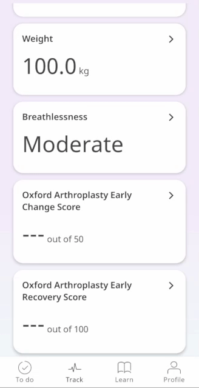
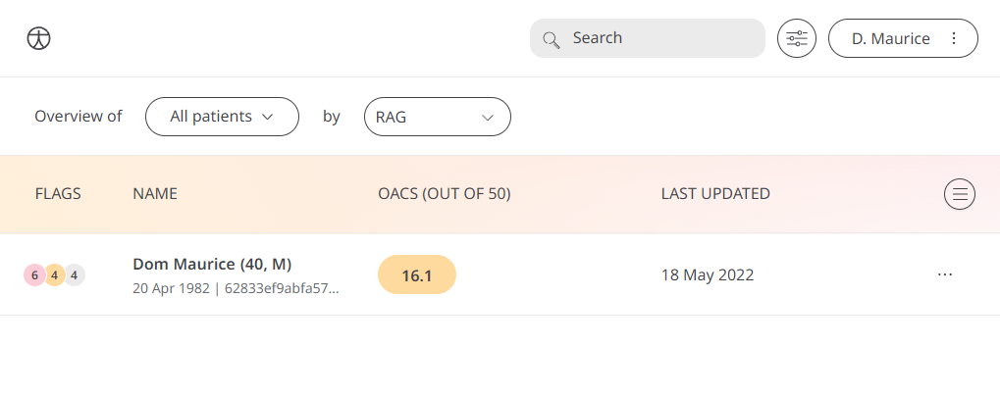

** Giving Surgeons a way to Assess Patients' Recovery Pathway **

Care can take many forms, one of which is post-surgery care for Patients. 
This looks like Surgeons assessing for the improvement in the quality of life of their Patients and advising on any steps to take. Therefore we have to deliver feedback from Patients to their Surgeons in order to help with the delivery of that care.

In Huma, we have taken the Oxford Arthroplasty Early Change Score (OACS) and used them to ask the Patient in-app about their post-surgery progress. This will give Surgeons the information needed to make decisions that are best for their Patients. 

## How it works

### Patients

In the Huma app, Oxford Arthroplasty Early Change Score can be selected and the Patient will be taken through a series of mobility questions, in the form of now compared to pre-surgery. The data capture will be a calculated score from -50 to +50 from the answers provided. The options to select are:
- Much worse
- Worse
- The same
- Better
- Much Better

From within the module, Patients can view their progress in a graph and press “Show all data” to view previous results in a table. Patients can also set a daily, weekly, or monthly reminder to help keep on track.

### Clinicians

In the Clinician Portal, on the Patient List, Clinicians can view a table of Patients, from which the Oxford Arthroplasty Early Change Score column will display the last recorded reading indicated as a Red Amber Green indicator to inform severity.

Clicking on the Patient row takes the Clinician to the Patient Summary where all vitals can be viewed, by selecting the Blood Pressure module all historic data can be displayed as a graph or a table of results.