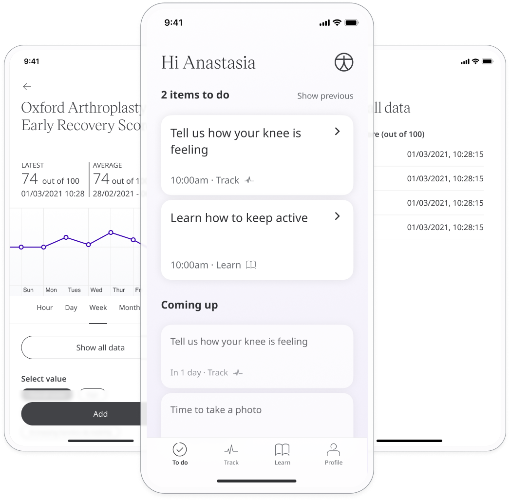
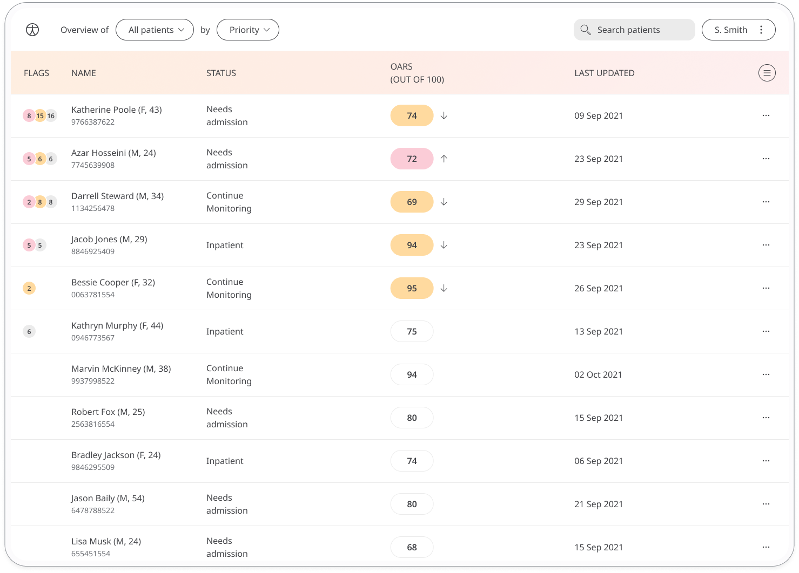

** Giving Surgeons a way to Assess Patients' Recovery Pathway **

Care can take many forms, one of which is post-surgery care for Patients. 
This looks like Surgeons assessing for the improvement in the quality of life of their Patients and advising on any steps to take. Therefore we have to deliver feedback from Patients to their Surgeons in order to help with the delivery of that care.

In Huma, we have taken the Oxford Arthroplasty Early Recovery Score (OARS) and used them to ask the Patient in-app about their post-surgery progress. This will give Surgeons the information needed to make decisions that are best for their Patients. 

## How it works

### Patients

In the Huma app, Oxford Arthroplasty Early Recovery Score can be selected and the Patient will be taken through a series of questions on how they feel. The data capture will be a calculated score out of 100 from the answers provided. The options to select are:
- Strongly disagree
- Disagree
- Neither agree nor disagree
- Agree
- Strongly agree

From within the module, Patients can view their progress in a graph and press “Show all data” to view previous results in a table. Patients can also set a daily, weekly, or monthly reminder to help keep on track.

### Clinicians

In the Clinician Portal, on the Patient List, Clinicians can view a table of Patients, from which the Oxford Arthroplasty Early Recovery Score column will display the last recorded reading indicated as a Red Amber Green indicator to inform severity.

