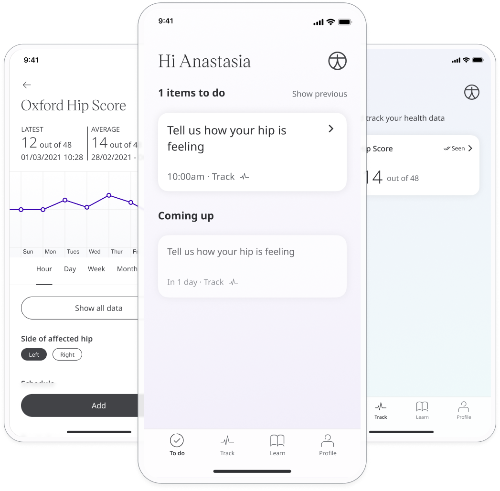
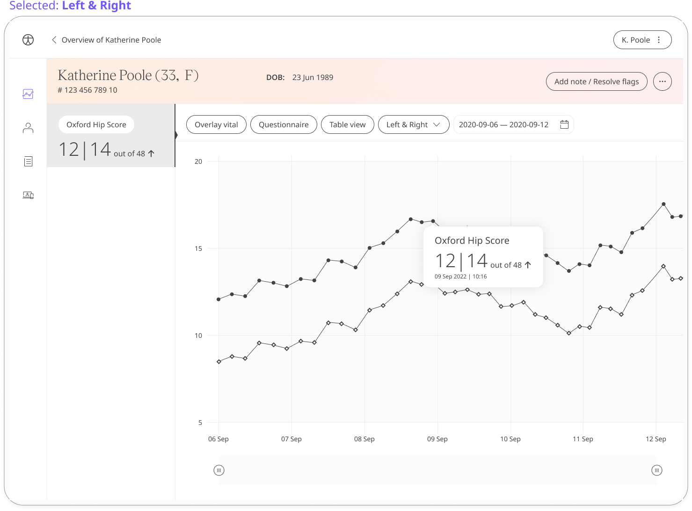

After Patients receive treatment it is important to know how successful that treatment is and if additional steps need to be taken. Huma provides the Oxford Hip Score to assess the function and pain after total Hip replacement. The information is available to Care Teams so they can initiate the post-surgery care.

## How it works

The Oxford Hip Score Questionnaire is a quick and effective way for Patients to assess pain for Care Teams in the Clinician Portal. The Patient responds to questions with pre-determined descriptive answers. Scores in Huma are calculated out of 48 is calculated, in which a lower score represents a better hip function.

## Patients

In the Huma App, from the “Track” screen, Patients can select Oxford Hip Score and by pressing “Add” can answer the questions to reflect how they feel.

From within the module, Patients can view their progress in a graph and press “Show all data” to view previous results in a table. Patients can also set a daily, weekly, or monthly reminder to help keep on track.

## Clinicians

In the Clinician Portal, on the Patient List, Clinicians can view a table of Patients, from which the Oxford Hip Score column will display the last recorded reading indicated as a Red Amber Green indicator to inform severity. 

Clicking on the Patient row takes the Clinician to the Patient Summary where all vitals can be viewed, by selecting Oxford Hip Score all historical data can be displayed as a graph or a table of results.

