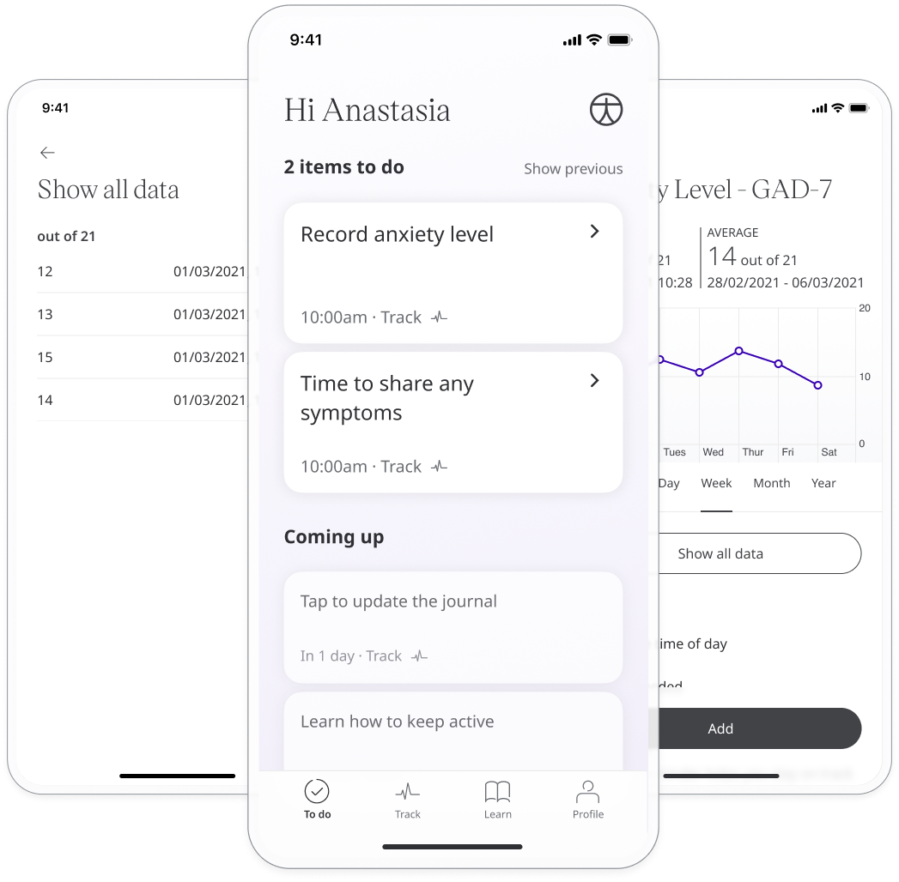
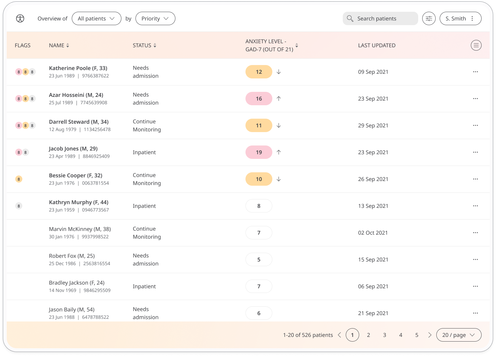
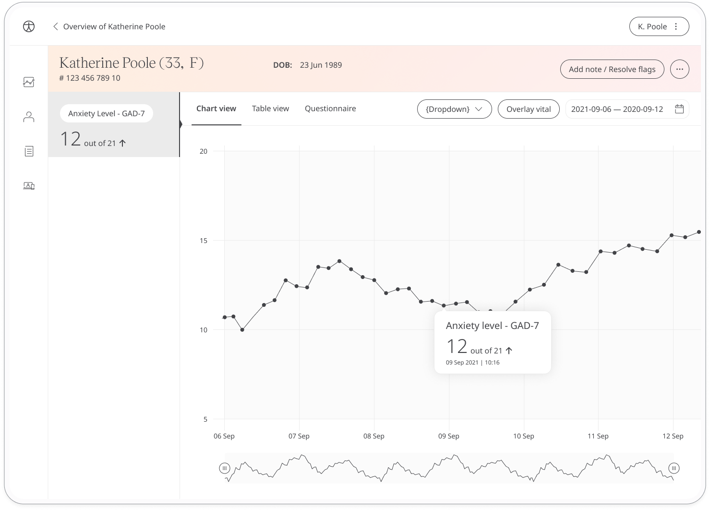

Anxiety is a feeling of unease that can be mild or severe and have a significant impact on how a person navigates their daily life. The General Anxiety Disorder-7 (GAD-7) questionnaire screens for and measures the severity of generalised anxiety disorder (GAD). 

## How it works

The GAD-7 questionnaire is a quick and effective anxiety assessment tool for care teams. Patients respond to questions that ask how they feel, such as “How often have you had trouble relaxing?” over the last 2 weeks. They answer from a set of multiple choice options that measure the scale of their anxiety:
- Not at all
- Several days
- More than half the days
- Nearly every day

To start, patients select the GAD-7 module and click "Add". From within the module, patients can view their progress in a graph and also access all their previous results. Daily, weekly, or monthly reminders can be set to help stay on track.

In the Clinician Portal, care teams will see the latest Anxiety Level - GAD-7 for their patient, with concerning scores flagged for attention. 

In the Patient Summary, care teams can view all historical data in graph or table form.

