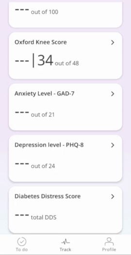
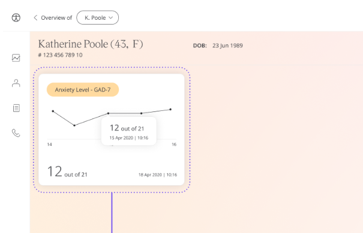

Looking after mental health is important for everyone, with that anxiety, is a feeling of unease, that can be mild or severe and can affect navigating daily life. 
Huma provides the General Anxiety Disorder-7 (GAD-7) questionnaire to screen and measure the severity of generalised anxiety disorder (GAD). 

## How it works

The GAD-7 questionnaire is used to be a quick and effective anxiety assessment tool for Care Teams in the Clinician Portal. Patients respond to questions that ask how they feel, such as “How often have you had trouble relaxing?” over the last 2 weeks with the following options:
- Not at all
- Several days
- More than half the days
- Nearly every day

## Patients

In the Huma App, from the “Track” screen, Patients can select Anxiety Level GAD-7 and by pressing “Add” can answer the questions to reflect how they feel.

From within the module, Patients can view their progress in a graph and press “Show all data” to view previous results in a table. Patients can also set a daily, weekly, or monthly reminder to help keep on track.

## Clinicians

In the Clinician Portal, on the Patient List, Clinicians can view a table of Patients, from which the Anxiety Level - GAD-7 column will display the last recorded reading indicated as a Red Amber Green indicator to inform severity. 

Clicking on the Patient row takes the Clinician to the Patient Summary where all vitals can be viewed, by selecting Anxiety Level - GAD-7 all historical data can be displayed as a graph or a table of results.

