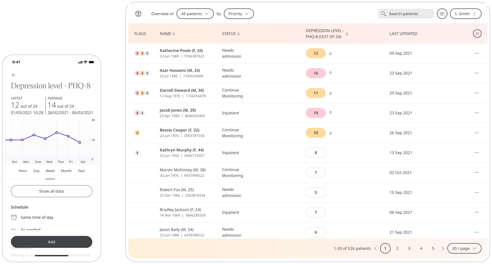

Depression affects many people and impeded the operation of day to day activities. Huma provides the Patient Health Questionnaire depression scale (PHQ-8) to Patients to screen for the presence and severity of depression. Patients can work with Care Teams to provide the care that is needed.

## How it works

The PHQ-8 questionnaire provides Care Teams with an assessment tool in the Clinician Portal. Patients respond to questions that ask how they feel, such as “Do you find little interest or pleasure in doing things” over the last 2 weeks with the following options:
- Not at all
- Several days
- More than half the days
- Nearly every day

## Patients

In the Huma App, from the “Track” screen, Patients can select Depression Level - PHQ-8 and by pressing “Add” can answer the questions to reflect how they feel.

From within the module, Patients can view their progress in a graph and press “Show all data” to view previous results in a table. Patients can also set a daily, weekly, or monthly reminder to help keep on track.

## Clinicians

In the Clinician Portal, on the Patient List, Clinicians can view a table of Patients, from which the Depression Level - PHQ-8 column will display the last recorded reading indicated as a Red Amber Green indicator to inform severity. 

Clicking on the Patient row takes the Clinician to the Patient Summary where all vitals can be viewed, by selecting Depression Level - PHQ-8 all historical data can be displayed as a graph or a table of results.

