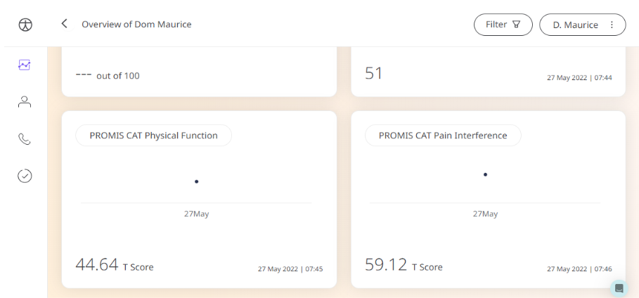

Huma provides the PROMIS CAT Physical Function Questionnaire which assesses physical function using a grading scale of activities of daily living to evaluate the outcome of individuals with musculoskeletal problems. The answers can be shared with Care Teams to gather insight to provide the Healthcare needed.

## How it works

In the Huma App, Patients can submit answers to the PROMIS CAT Physical Function Questionnaire which contain questions that describe daily activities and Patients choose from a list of pre-defined answers that they feel is the truest.

## Patients

In the Huma App, Patients can select “Questionnaire” from the track screen. They can select the PROMIS CAT Physical Function and answer the questions according to how they feel.

## Clinician

In the Clinician Portal, on the Patient List, Clinicians can view a table of Patients, from which the PROMIS CAT Physical Function column will display the last recorded reading indicated as a Red Amber Green indicator to inform severity. 

Clicking on the Patient row takes the Clinician to the Patient Summary where all vitals can be viewed, by selecting PROMIS CAT Physical Function all historical data can be displayed as a graph or a table of results.

