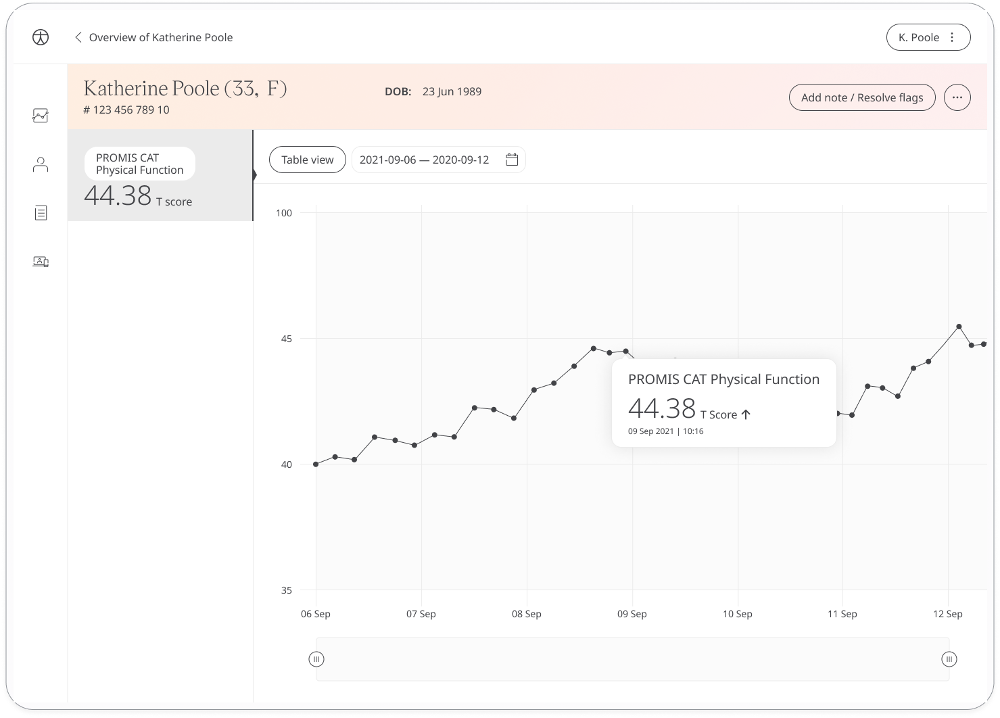

Huma provides the PROMIS CAT Pain Interference Questionnaire which quantifies a person's self-reported pain effects on essential parts of their lives. The answers can be shared with Care Teams to gather insight to provide the Healthcare needed.

## How it works

In the Huma App, Patients can submit answers to the PROMIS CAT Pain Interference Questionnaire which contain questions that ask how often or severe pain interferes with daily activities Patients choose from a list of pre-defined answers that they feel are the truest.

## Patients

In the Huma App, Patients can select “Questionnaire” from the track screen. They can choose the PROMIS CAT Pain Interference and answer the questions according to how they feel.

## Clinicians

In the Clinician Portal, on the Patient List, Clinicians can view a table of Patients, from which the PROMIS CAT Pain Interference column will display the last recorded reading indicated as a Red Amber Green indicator to inform severity. 

Clicking on the Patient row takes the Clinician to the Patient Summary where all vitals can be viewed, by selecting PROMIS CAT Pain Interference all historical data can be displayed as a graph or a table of results.

