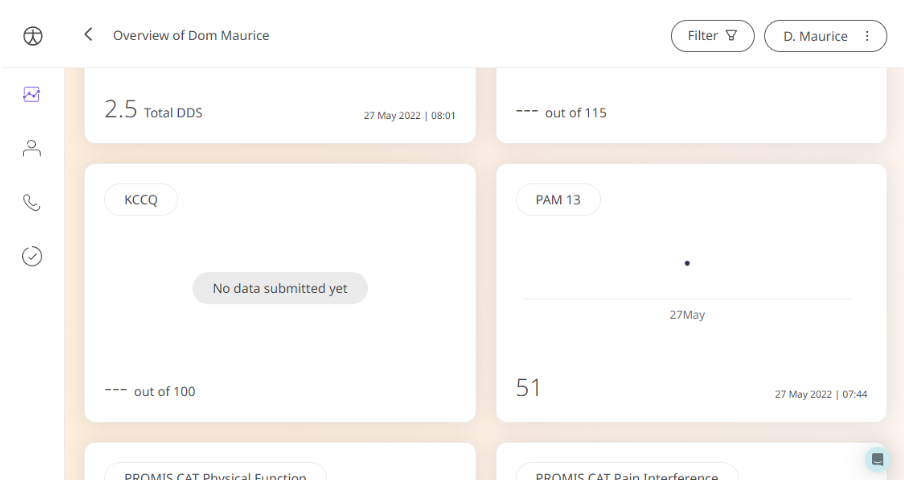

The Patient Activation Measure is an easy way for Patients to provide information about how confident they are in managing their health. Clinicians can view this data to understand what care needs to be delivered.

## How it works

Patients answer generic questions about how they feel about their health. Care Teams can then access those answers through the Clinician Portal.

## Patients

In the Huma App, Patients can select “Questionnaire” from the track screen. They can select the Patient Activation Measure-13 and answer the questions according to how they feel.

## Clinicians

In the Clinician Portal, on the Patient List, Clinicians can view a table of Patients, from which the Anxiety Level - GAD-7 column will display the last recorded reading indicated as a Red Amber Green indicator to inform severity. 

Clicking on the Patient row takes the Clinician to the Patient Summary where all vitals can be viewed, by selecting Anxiety Level - GAD-7 all historical data can be displayed as a graph or a table of results.

