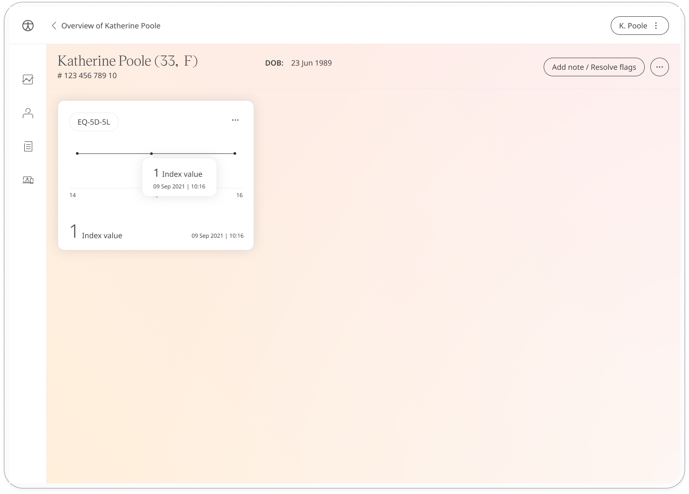
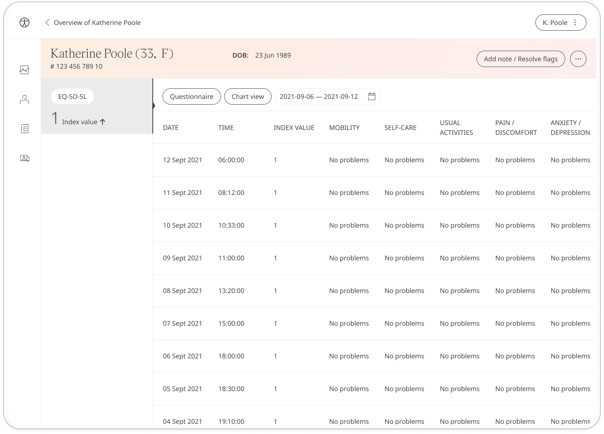

The EQ-5D-5L is a licensed, self-assessed, quality of life PROM questionnaire. Huma provides the questionnaire in-app, allowing Patients to continually evaluate their quality of life and deliver that assessment to Care Teams in order to make decisions about the Patient’s health.

## How it works

In the Huma App, the EQ-5D-5L questionnaire measures quality of life on a 5-level scale including mobility, self-care, usual activities, pain/discomfort, and anxiety/depression. Patients give both descriptive and scaled answers, of which the Index value is given and available to Care Teams through the Clinician Portal.

## Patient

In the Huma App, Patients can select the EQ-5D-5L questionnaire and answer the questions according to how they feel. Patients can see their past entries within ‘Previous entries’

## Clinicians
In the Clinician Portal, on the Patient Summary, Clinicians can view all data submitted, from which the EQ-5D-5L module will show the historic entries from the Patient. The index score from 1-5 will be displayed in the EQ-5D-5L module details screen, and from the Patient Summary a calculated 5 digit Health State can be viewed as the Primary Value of EQ-5D-5L.

