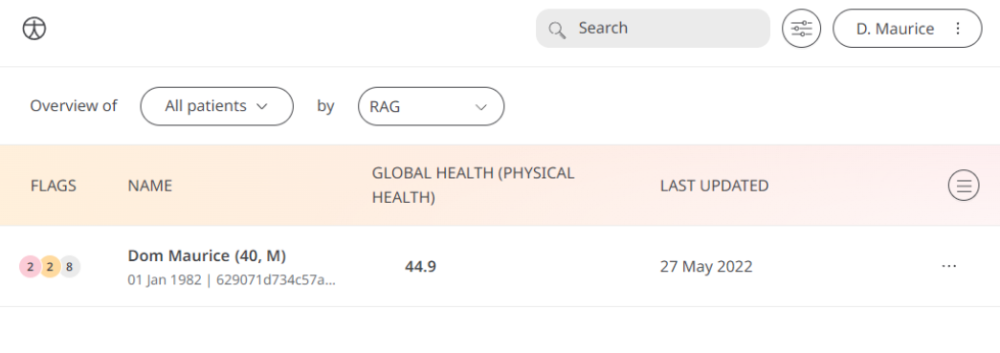

The Patient-Reported Outcomes Measurement Information System (PROMIS) Global Health is a licensed PROM questionnaire that captures Global Health Patient data. It contains a set of 10 multiple choice (single answer) questions. Huma provides the PROMIS Global Health module to assess an individual’s physical, mental, and social health, by asking generic questions about them. Care Teams can access those answers and the 2 calculated scores - ‘Physical Health’ and ‘Mental Health’ through the Clinician Portal to gather insights.

## How it works

## Patients

In the Huma App, on the Track Screen Patients can select Global Health, and by pressing “Add” can enter the questionnaire and proceed to answer questions in a way that reflects how they feel.

From within the module, Patients can view their progress in a graph and press “Show all data” to view previous results in a table. Patients can also set a daily, weekly, or monthly reminder to help keep on track.

## Clinicians

In the Clinician Portal, on the Patient List, Clinicians can view a table of Patients, from which the Global Health column will display the last recorded reading indicated as a Red Amber Green indicator to inform severity. 

Clicking on the Patient row takes the Clinician to the Patient Summary where all vitals can be viewed, by selecting Global Health all historical data can be displayed as a graph or a table of results.