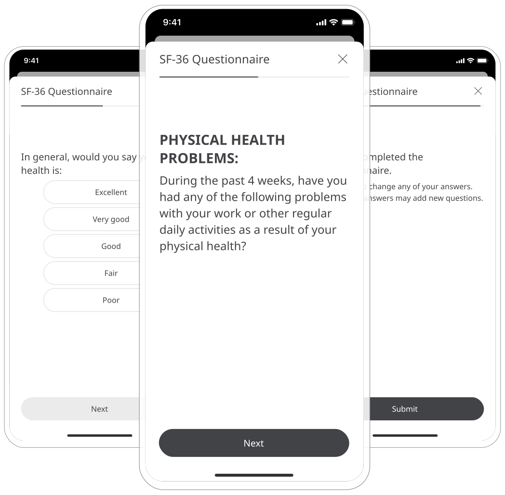

Assessing a Patient’s self-reported quality of life and functional health and well-being, can help evaluate their health status. Therefore, Huma provides the Short Form Health Survey (SF-36) licensed PROM questionnaire to gather the perspective of the patient when it comes to their ability to fulfil daily functions. Working with Care Teams can help determine any actions that need to be taken and how conditions are managed. 

## How it works 

In this questionnaire, there are questions scored on a scale from 0 to 100, with 100 representing the highest level of functioning possible. There are 8 scores calculated following the submission of the questionnaire.
- Physical function
- Role functioning/physical
- Role functioning/emotional
- Energy/fatigue
- Emotional well being
- Social functioning 
- Pain
- General Health

## Patients

In the Huma App, Patients from the Track screen can select Short Form Health Survey. From here, pressing “Add” will that them through the questions that can be answered to the best of their ability. 

From within the module, Patients can view their progress in a graph and press “Show all data” to view previous results in a table. Patients can also set a daily, weekly, or monthly reminder to help keep on track.

## Clinicians

In the Clinician Portal, on the Patient List, Clinicians can view a table of Patients, from which the SF-36 column will display the last recorded reading indicated as a Red Amber Green indicator to inform severity. 
Clicking on the Patient row takes the Clinician to the Patient Summary where all vitals can be viewed, by selecting the SF-36 module all historic data can be displayed as a graph or a table of results.

