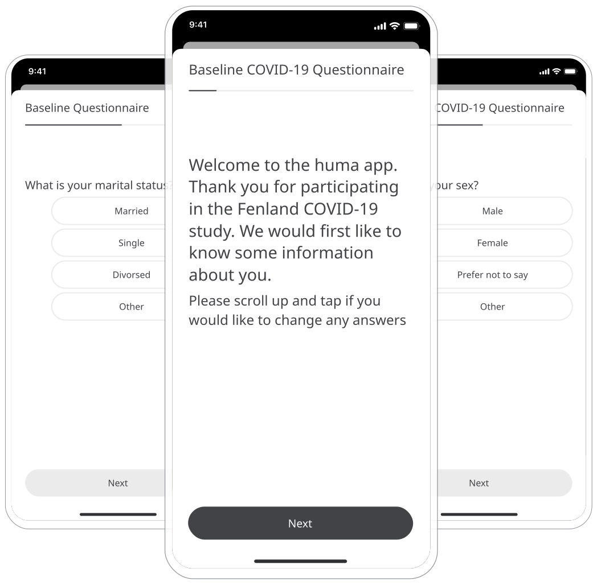

In bringing Patients into the Huma product includes an easy way of collecting information about their health. Answering all questions and sharing this information will allow Care Teams to make better treatment decisions.

## How it works

### Patients

As a Patient onboards in the Huma App, they will be taken through the Baseline Questionnaire, which are questions that will provide basic information into a Patient’s account. 

