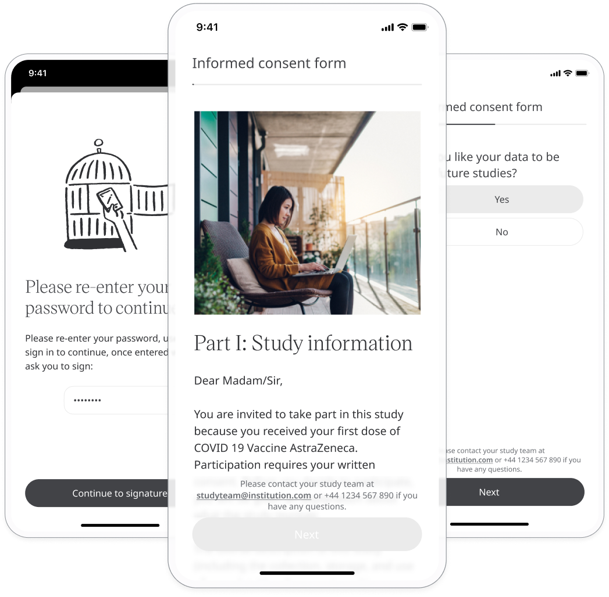

** Giving the control of data to Participants **

Huma aims to deliver a host of data to further clinical research in a digital environment, therefore Participants who opt into trials are required to sign an electronic informed consent form Consequently, through both regulation and Huma’s own values, consenting through an electronic means is a feature that we strive to deliver the control of a Participant’s data to themselves.

## How it works

Huma provides the functionality of the whole eConsent process, therefore Health Care institutions can create their consent document on the platform which is then presented to users of the Huma App to confirm or deny.

### Patients

From inside the Huma app, a Patient can accept, view, retract, and re-consent amendments to the eConsent that is currently active. This can be viewed in the Profile and Informed consent forms.

### Administrators

In the Admin Portal, a new consent form can be created by navigating to the Deployment and then Onboarding. Here when you click “Add onboarding” there is the option for “E-Consent”.

Once selected it will appear on the onboarding table. Click the edit button and fill in the details of the e-Consent, the documentation itself, and any questions that are necessary.

## Withdrawing Consent

** Participants in studies maintaining control over their data **

As with any supply of data, consent and processes need to sit with the user and be delivered in a clear way. Participants can opt-out and maintain control over their data. The process and who to contact is unknown and can lead to a lack of confidence and control.

Participants can easily withdraw their consent at any time from in the app itself, without having to search for it or contact a customer support representative. This gives control to the Patient when they need it, at any time.

Navigate to Profile and Informed consent forms, when a consent form is selected then the option for “Withdraw your consent” is shown.