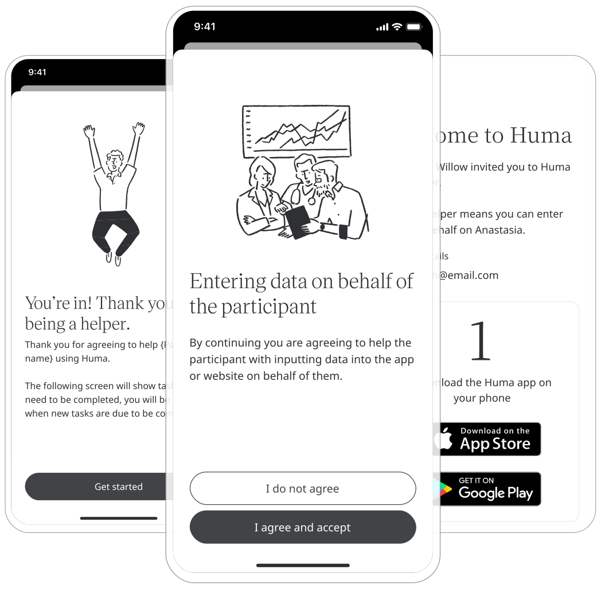

In some cases, another party will have to manage the data entry in the Huma App on behalf of a Patient if they are unable to. In order to enable helpers to fulfil that role, they can easily join Huma through an invitation from the Care Teams.

## How it works 

Care Team can invite Helpers from the Clinician Portal once the helper agreement has been added in via the Admin Portal.

### Administrators

From the Admin Portal, the Helper agreement can be added from a Deployment, selecting Onboarding and clicking on “Helper agreement”.

<!--  -->

### Clinicians

From the Clinician Portal, in the Patient View and Account details, Care Teams can click “Add a helper” and from there the Helpers’ email is added and they are invited in the same way a Patient is. Also viewing the activation status and removing the Helper can be achieved from the same location.

<!--  -->

### Helpers

As Helpers receive their invite and are prompted to download the Huma App, they are taken through the sign up and onboarding process. Once in the App, Helpers can enter data into modules in the same way that a Patient or Participant would.

