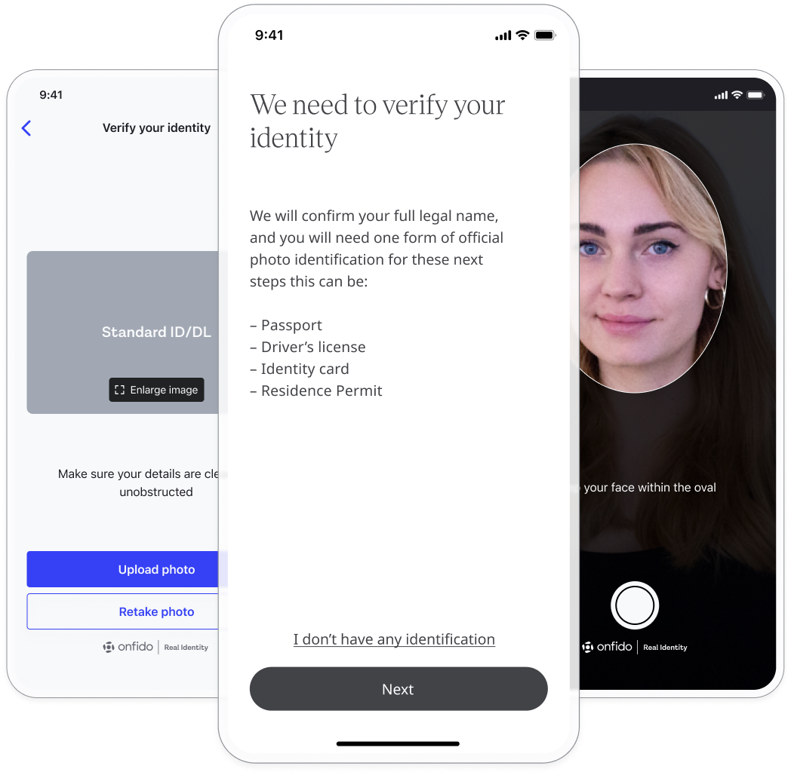

In some cases, having a verified person use the Huma App is required, therefore an ID verification is available to ensure the right person is logging in to a particular deployment.

## How it works

### Administrators

From the Admin Portal, the Helper agreement can be added from a Deployment, selecting Onboarding and clicking on “Identity verification”.

<!--  -->

### Patients

When identity verification is required, the Patient will be prompted to first upload a form of ID and then to take a photo of themselves. From there, verification will be complete in up to 60 seconds and be prompted when completed.

