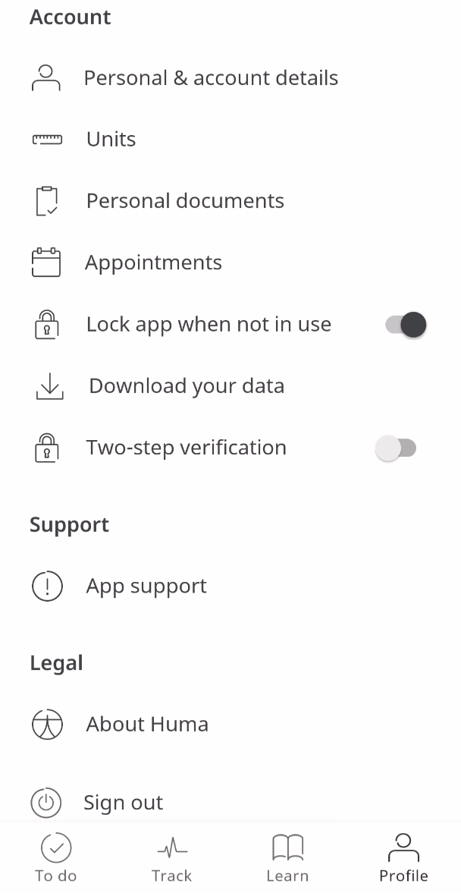

** Security and Ease on Login **

Using digital products requires authentication and security and with Huma, the protection of that data in all forms is incredibly sensitive. Therefore the process needs to be assured and confident that the right person has access. Passwords are hard to remember and being able to have an easy sign-in is a challenge, which often leads to bad passwords or password resetting, which is long and frustrating. 

## How it works

Now users can authenticate with the biometrics available on their devices — eliminating the need to remember passwords. This uses the factor of who someone is — e.g. fingerprint, facial recognition — rather than something they know — e.g. a password. This will create a seamless experience when logging into the app. 

Biometrics are switched on in the Huma App, from the Profile page under Account, and by toggling “Two-step verification”, from here Patients will be prompted to add a Biometric log in relative to the device being used.

<!--  -->

New Patients will be prompted to add Biometric login whilst signing up if the Health Care provider has enabled it as mandatory.
