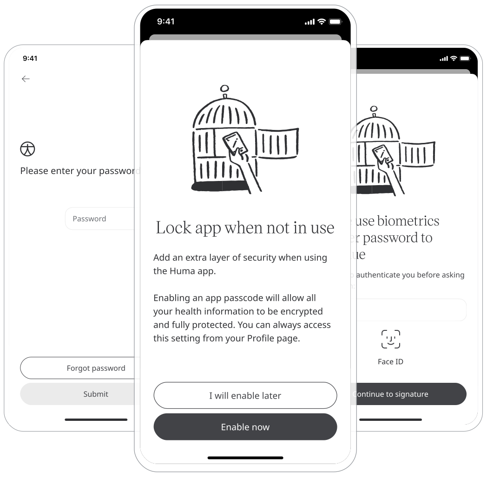
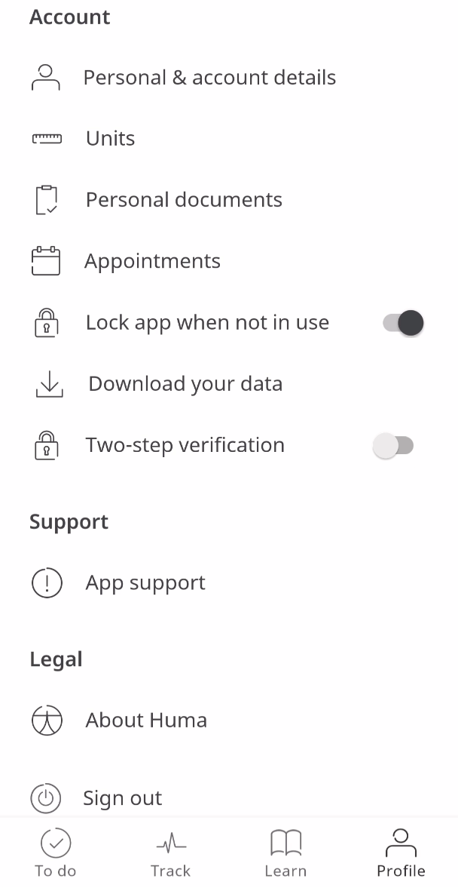

** How Huma keeps your data safe **

Huma takes the responsibility of everyone’s data seriously as we are aware of the sensitivity involved. With that, it is vital that the platform is accessible and secure at all points of entry, and we build our system to cope with all eventualities.

## How it works

Huma offers 2-factor authentication via password entry and entry of verification code sent to mobile for mobile and web to ensure that the person signing in is the person they say they are. This adds an extra layer of security and in the event of a compromised password then a malicious individual can be stopped before accessing any sensitive data.

### Patients

In the Huma App, this can be turned on from the Profile page under Account, and toggling “Two-step verification”. From there, they will be taken through steps to add a phone number and then sent a verification code via text message. 

### Clinicians 

When signing up to the Clinician Portal, two-step verification via text message is on by default, therefore members of the care team invited to the platform they are prompted to add a phone number as part of signing up.

### Administrators

From the Admin Portal, Administrators can enforce multiple-factor authentication by going to the Deployment, selecting Deployment config and checking “multiple-factor authentication”.

## Biometric Login

** Security and Ease on Login **

Using digital products requires authentication and security and with Huma, the protection of that data in all forms is incredibly sensitive. Therefore the process needs to be assured and confident that the right person has access. Passwords are hard to remember and being able to have an easy sign-in is a challenge, which often leads to bad passwords or password resetting, which is long and frustrating. 

Now users can authenticate with the biometrics available on their devices — eliminating the need to remember passwords. This uses the factor of who someone is — e.g. fingerprint, facial recognition — rather than something they know — e.g. a password. This will create a seamless experience when logging into the app. 

Biometrics are switched on in the Huma App, from the Profile page under Account, and by toggling “Two-step verification”, from here Patients will be prompted to add a Biometric log in relative to the device being used.

<!--  -->

New Patients will be prompted to add Biometric login whilst signing up if the Health Care provider has enabled it as mandatory.