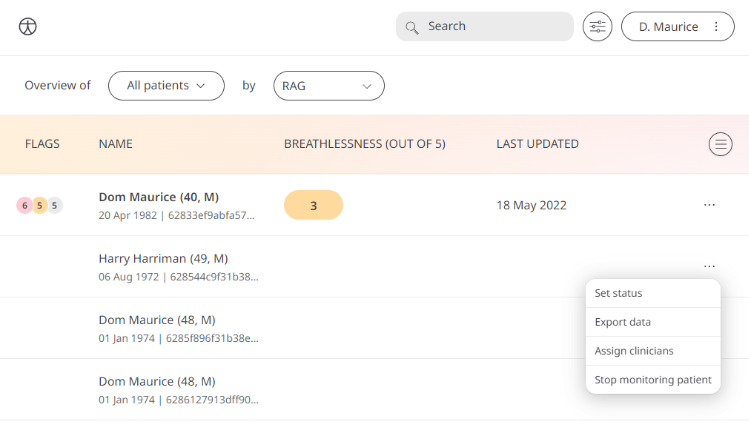
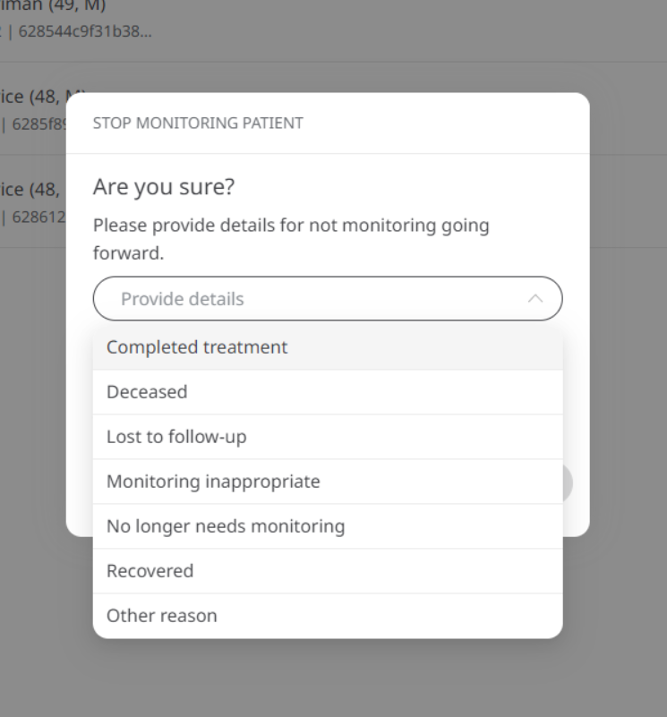

** When Monitoring has stopped for a Patient giving a reason provides context and keeps an audit trail **

Clinicians and Study Coordinators need to follow the regulatory guidelines and processes involved in giving care to Patients and regarding the information collected from Participants in a clinical trial. An audit trail is needed to be present to refer to any eventuality during — and importantly in this context — aftercare or the trial. The reasoning behind the exiting of someone from monitoring is unknown because there is no means to provide the context needed when off-boarding.

## How it works

When “Stop Monitoring Patient” is selected from the context menu in the patient view, the user is prompted to give a reason for the exit of the patient from a predetermined list of options as defined per regulatory requirements.

