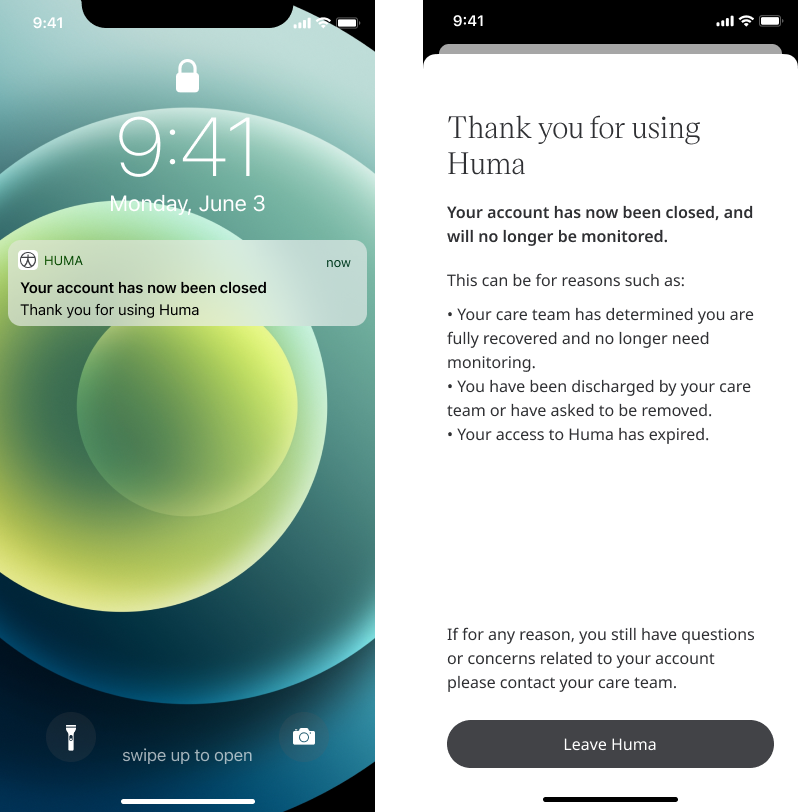

** Communicating to Patients that are no longer being monitored **

Patients require confidence in using the platform so they feel comfortable with their care and in sharing their data. It is important to inform them of what is being actioned and why at every point in their journey, which includes at the end of the care. This can be a stressful time and so reassurance is vital at this point to ensure that confidence remains after using the platform.

## How it works

When a Patient is off-boarded, they are informed at the end of monitoring with a list of possible reasons why this has happened. This will reassure them that this is a standard process and helps with providing context and confidence.

<!--  -->