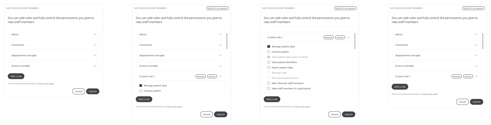

As a variety of people with different responsibilities access the platform through the Huma App, Clinician Portal, and Admin Portal, the data of the patient and institution has to be accessible with the sensitivity needed every particular instance. Therefore, Huma provides roles that are a collection of permissions that assign specific access for specific users. The combination of a role and the context of the action being taken then define the user’s ability to view or manage data.

## Clinicians

Members of a Care Teams can be expressed as the following Roles:

**Contributor** – any team member invited by an Admin with restricted access to the platform.

**Admin** – any team member invited as Admin by another Admin, with full access to the platform. This includes inviting and removing staff members, along with adding new roles when needed.

**Deployment staff** – any team member invited by an Admin or Access controller, with restricted access to the platform.

**Organisation staff** – any team member invited by an Admin or Access controller or a fellow Organisation staff, with restricted access to the platform.

**Access controller** – any team member invited as Access controller by an Admin or a fellow Access controller, with restricted access to the platform.

The Permissions that relate to the Roles are explained in the table below.

