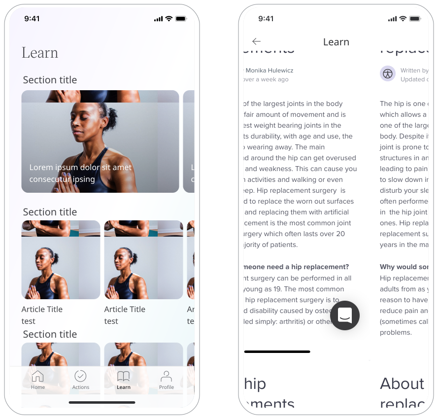

As institutions operate to deliver health care they will gather resources to help patients manage their care and conditions. Huma provides the Learn feature so content can be shared directly with Patients in-app. 

## How it works

From a Deployment, content such as links, PDFs, and videos, are added and will appear in the Huma App for Patients to consume at any time.

### Administrators

From a particular Deployment in the Admin Portal, Administrators can click on “Learn” and create or edit a Section. Inside the Section, Articles can be added by giving it a title, thumbnail, and the option to upload a document or providing a link.

<!--  -->

### Patients

In the Huma App, Patients can access the Learn feature from the bottom navigation menu and are presented with a grid of the available Articles separated by Sections. Clicking on an Article will load the document, video or website to review.

