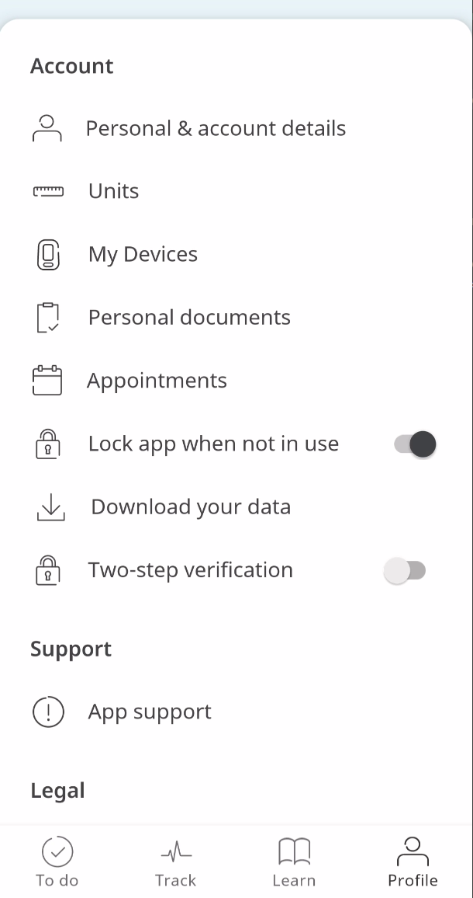

The Profile screen represents information regarding the Patients' identity in the Huma App, and settings that direct the experience for them. These can be edited at any time and viewable by Care Teams so that they can be informed about the aspects that relate to the health to be delivered.

## How it works

### Administrators

From a Deployment in the Admin Portal, Administrators can customise the experience of the Patient who uses the Huma App. In "App features", each feature can be toggled on and off for the Patients.

<!--  -->

### Patients

Selecting the Profile on the bottom navigation bar of the Huma App, Patients are presented with all the information relating to them and editable.

#### Personal & account details

Basic information about the Patient can be edited here, such as name, gender, etc. In addition, at the bottom is a button to change their password.

#### Preferred Units

From person to person, how a particular vital is measured varies, so the Huma app allows users to adjust the Units used throughout the App.

#### Personal Documents

As Patients receive documents relating to their healthcare, e.g. vaccination cards, they can be uploaded to their Care Teams via the Personal Documents feature. By selecting "Personal Documents", and "Add new document", Patients are prompted to add either a PDF from the device or a photo from the camera or device's library.

#### Appointments

As Care Teams book appointments with Patients, previous and upcoming Appointments will be shown on the Profile Screen. 

<!--  -->

#### Lock app when not in use

Users will be prompted at sign-up whether to enable App lock when re-opening the Huma App. This will use the OS’s native device lock (e.g., biometrics or passcode) and can be toggled on/off from the Patient’s Profile page. If authentication were to fail, the App will ask for the User’s password instead.

#### Download your data

Every Patient in Huma has their data and results which can be exported normally in a CSV format or using the PDF Summary Report. By clicking on “Download your data”, on the next screen they can click “Request a download”, and returning to this screen will enable saving the exported data.

#### Two-step verification

Patients are required to periodically authenticate with an additional mechanism along with their email and password. Every user is also required to provide their mobile number which will be used for sending a verification code for an additional factor of authentication

#### App Support

Patients can receive support in-app by connecting with one of the teams in a live chat, and gain access to support documentation.

#### Device Integration

The Huma App can connect to Bluetooth-enabled devices to automatic take readings and input them into the relevant modules. The available device types are:

- Blood Pressure
- Pulse Oximeter
- Weighing Scales
- Spirometer

#### Proxy / Helper

In Huma, a patient can invite a helper who can manage data/information on behalf of the patient. As Helpers receive their invite and are prompted to download the Huma App, they are taken through the sign-up and onboarding process. Once in the App, Helpers can enter data into modules in the same way that a Patient or Participant would.

