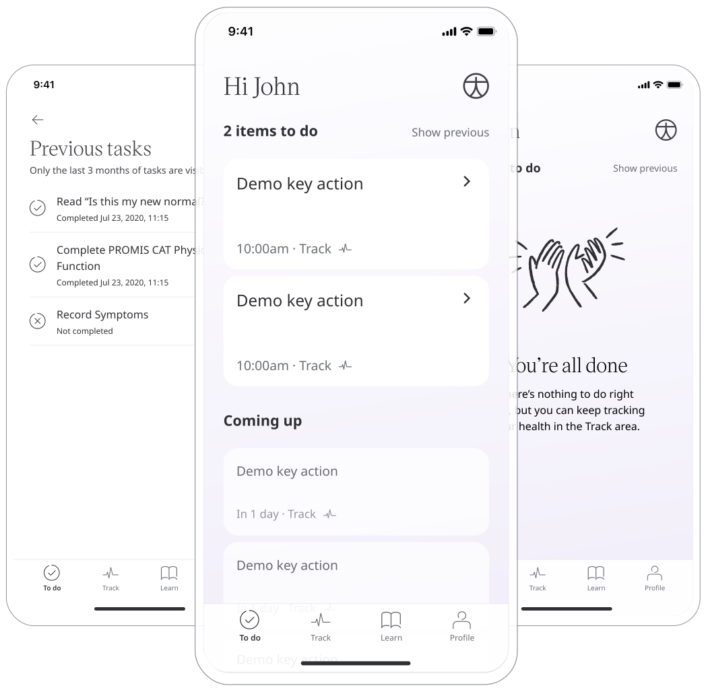

The health care journey for Patients involves providing what needs to be done and when. Therefore, Huma’s To-do/Timeline feature is a place where Patients can understand their pending and upcoming key actions right from the home page.

## How it works

As Care Teams require data and feedback from Patients, Clinicians can create an action directly for a Patient or when certain conditions are met in the Clinician Portal.

### Patients 

When Patients log into the Huma App they are taken to the To-do/Timeline screen, where they can see at which exact time they are expected to complete a certain item. Appointments are displayed here either to confirm or upcoming, display the date and time on request. 

