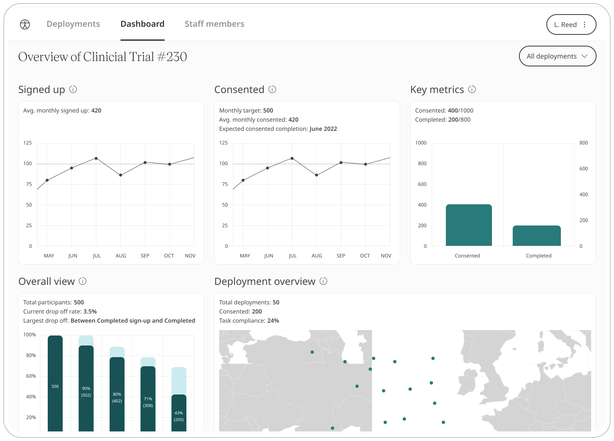

Huma takes a holistic approach to the Patients healthcare journey. As they move between various Care Teams, it is important the Patient data moves with them. An example of this is a Patient being escalated from a GP to a Consultant. 

## How it works

Huma provides Multi-Deployment, an instance that contains particular Patients and Care Teams aligned with the function of the healthcare or research intended. 

## Administrators

Clinicians are invited from a Deployment in the Admin Portal by Administrators, from there the Care Teams will invite Patients and those personas will be associated with that deployment.

