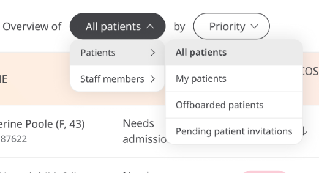

** Find Patients Faster **

When it comes to Clinicians’ time, it is important to recognise that administration takes time away from care. Being able to find Patients and their data quickly makes the flow of decision-making and prioritisation one that does not require the time-consuming organisation of files and tables.

## How it works

In Huma, you can sort lists more intentionally and align them with the task at hand. Through this, the Clinician who is in a mode of prioritising tasks can use the app in line with the work being carried out. The sorting is as follows:

- Patients: 
    - All patients
    - My Patients
    - Off Boarded patients
    - Pending Patient Invitations 
- Staff:
    - All staff members
    - Pending Staff invitations

