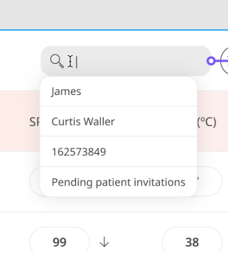
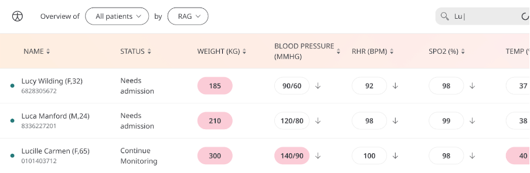

** Finding the Data you need **

Huma endeavours to provide the best tools for Clinicians so they can manage, prioritise, and make decisions on care. Organising Patient lists and assessing stats is time spent on the administration that is taken away from elsewhere. 

## How it works
	
The layout of the Patient list will give you the Patient sorted by Red-Amber-Green, putting the highest priority first. With that, the list of patients can be sorted by name, date of birth, and last updated. Also, suggested search terms from history will help Clinicians get back to where they left off.

