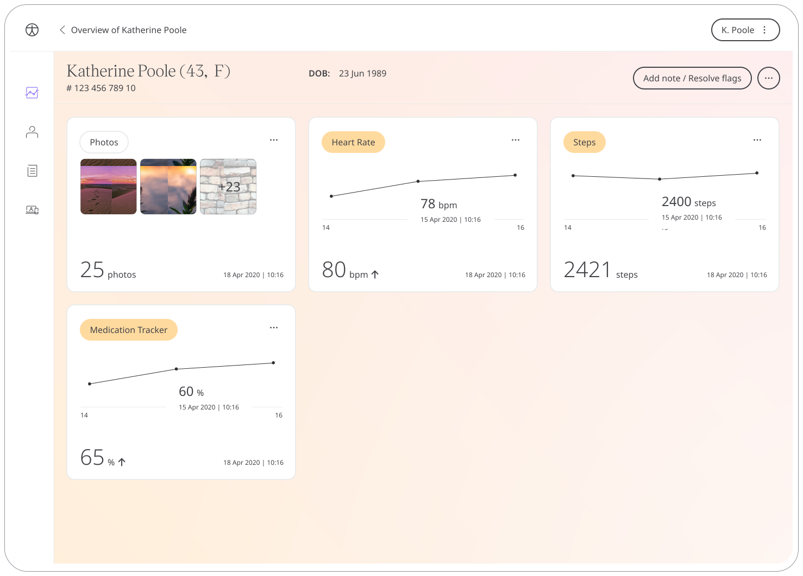

As Care Teams work with Patients, Clinicians need their details for further communication and to be up to date with relevant information. Huma presents a Patient Summary, where basic Patient information can be found and edited, in addition, important documents can be added here too.

## How it works

As Patients go through onboarding they add their personal information as set up in the Admin Portal by Administrators. In the Clinician Portal, Care Teams can view and edit details to make sure they and the data are up to date.

## Patients

In the Huma App, Patients will update detail in the onboarding flow by going to Profile and Personal and account details. Here Patients can edit any fields and press save in the top right. Patients can also upload photos and PDF documents in Personal Documents.

## Clinicians

In the Clinician Portal, the Patient summary can be viewed by clicking on a particular patient in the Patient List and the profile icon. On this page, data can be viewed and edited by clicking the pencil icon. From here, Care Teams can also add to Personal Documents.

## Administrators

From the Admin Portal, the fields to be available in Patient Summary can be configured in a chosen Deployment, and by clicking on Profile. On this screen, Administrators can enable fields to be presented to the Patient, create custom fields, make any of them manditory, and change the order of them. 

<!--  -->

Certain fields are required in modules, such as height in BMI, and will appeared grey out when that module is added into the deployment.