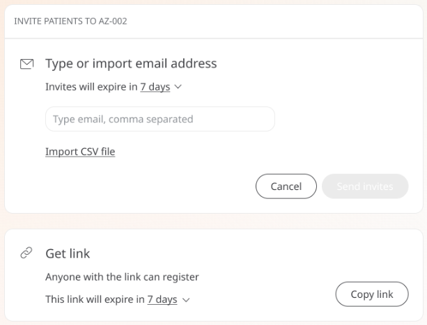

** Meeting patients where they communicate **

For Care Teams, it is important that inviting patients to the platform is easy and the technology does not act as a barrier to completing that task. In addition, the method of invitation needs to be accessible and intuitive for the Patient.

Even with email being ubiquitous, it is not the prefered form of communication for many Patients. The URL generated does not translate well to other forms of messaging such as SMS creating a barrier to entry with broken or suspicious-looking links.

## Functionality

The Huma portal now provides a “Get link” button for alternate means of communication — giving Clinicians the ability to invite their Patients via methods other than email.

The URL generated is short enough to work with SMS or any popular messaging app without any issues for the invitee. This gives confidence to both Patients and Clinicians.

