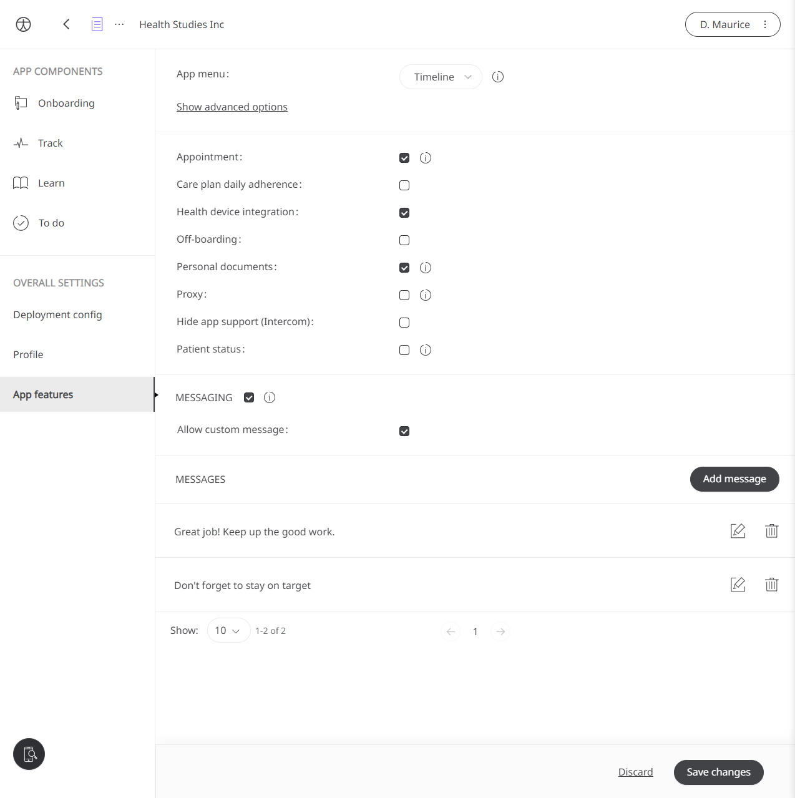
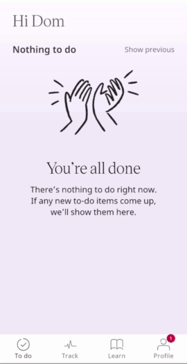

** Using messaging to connect people for Care and Clinical Study **

Huma facilitates the connection between Patient and Clinician as well as Participant to Site Investigator. Therefore, basic communication is part of the core experience of the platform, and here Huma's built-in messaging platform becomes a powerful tool to connect people. 

## How it works

## Administrators

In the Admin Portal, Administrators can enable the Messing feature by entering a Deployment, selecting App features and checking "Messaging". Here, the messages that can be sent are created, and the ability to enable functionality to create custom messages.

## Clinicians

As Clinicians need to update and inform Patients, the one-way messaging system built into Huma will allow them to quickly send a message to convey positive affirmations, tips to help with progress, accountability, or something custom that a Clinician would see as appropriate

From the Patient Summary in the Clinician Portal, clicking the 3 dots in the top right and clicking "Send message" will open the modal where a predetermined message can be sent, or a custom message if available.

## Patients

In the Huma App, as well as Patients recieving a notification on their device, they can go to Profile and Messages, where all recieved messages can be found.

