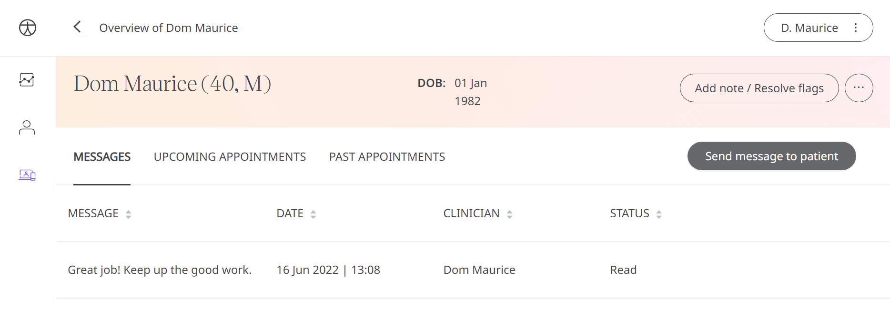

** An integral part of care is communication, and it’s important for Clinicians to be able to see if a patient has read their messages and feedback. **

Huma aims to aid the decision-making process of the Care Team. With that, in the scenario that a Patient has not read a message, either because it has not been delivered or gone unread in a timely manner, then the Clinician needs to be informed to take alternative action if necessary.

## How it works

In the messages table for a Patient is a ‘status’ column which will either show ‘Sent’, ‘Delivered’, or ‘Read’. This will inform Clinicians if their points of action have been read and they now will be able to follow up through other means if a Patient has not received or read their communications.

