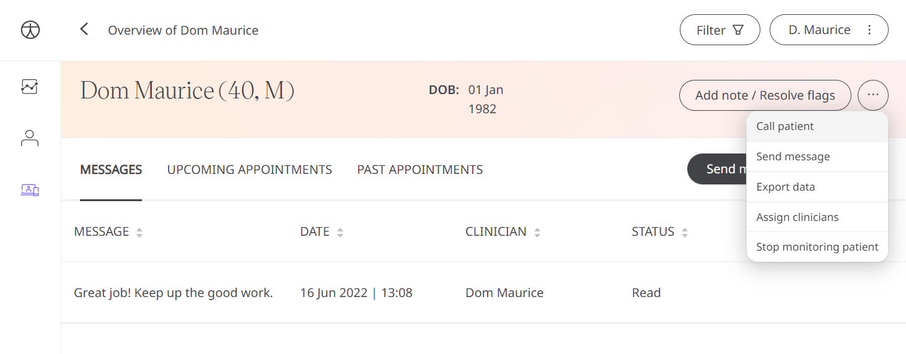
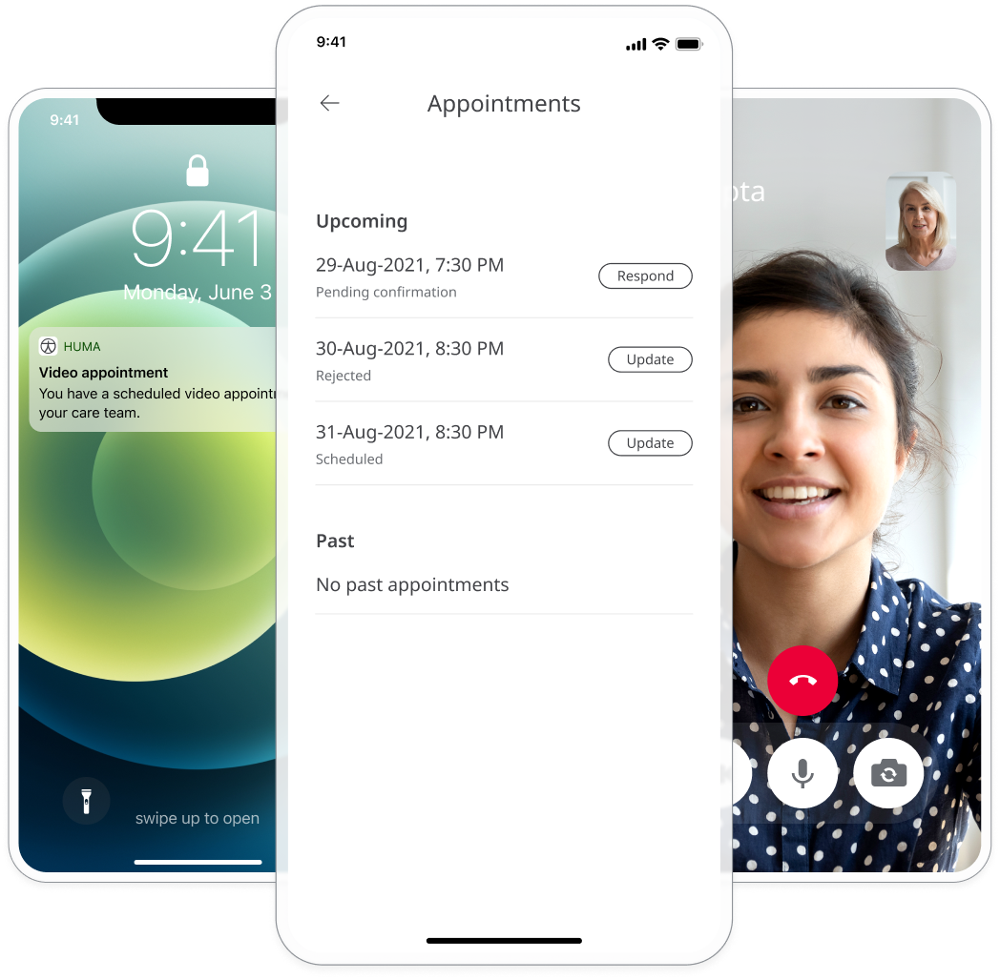

Patients to need to receive additional support from their clinical team through secure video and audio consultations. Clinicians may swiftly and securely interact with patients via video and voice calls and schedule in-person consultations to verify they are on track with their care plan and to check any abnormalities highlighted in their health records using Huma's real-time video calls.

## How it works

### Clinicians

The video call functionality is available in the web browser from the Clinician Portal. From the Patient Summary in the Clinician Portal, clicking the 3 dots in the top right and clicking "Call Patient".

<!--  -->

When joining a call, the browser will pop up a window. In the call window, clicking the camera icon will start and stop the webcam, the phone icon will end the call, and the microphone icon will mute and unmute.

To enable calls, make sure your browser settings allow camera and microphone use.

#### Missed Calls

When a call on Huma does not complete, a reason is provided so that actions can be taken, e.g. try again, wait until later, attempt an alternative, etc. The options shown will be:

- Call declined
- No network detected
- No answer

To go with this a "missed call" notification will be presented to the Patient which will take them to the Book Appointment screen to complete the goals of communicated information that is needed.

### Patients

Video calls are joined in the Huma App, and the Patient’s phone will ring when a Care Team member joins the call. Patients will have the option to “Accept” or “Reject” the call, once in the call the buttons to control will disappear after a short period of time and can be brought back by tapping the screen.

Pressing the camera icon will start and stop the camera, and the microphone icon will mute and unmute, the camera with the arrow icon will swap between the front-facing and rear-facing camera, and the phone icon will end the call.

