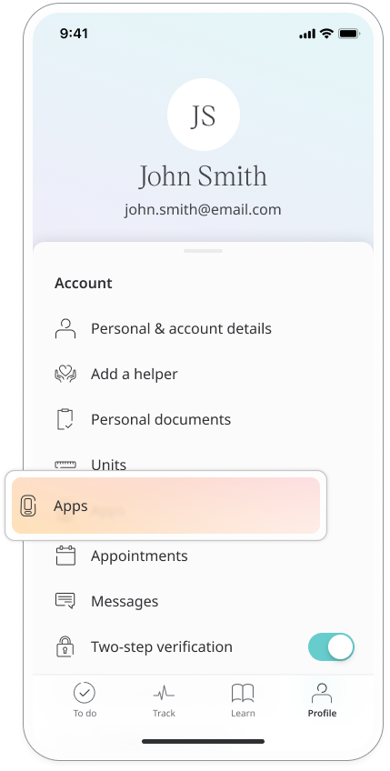
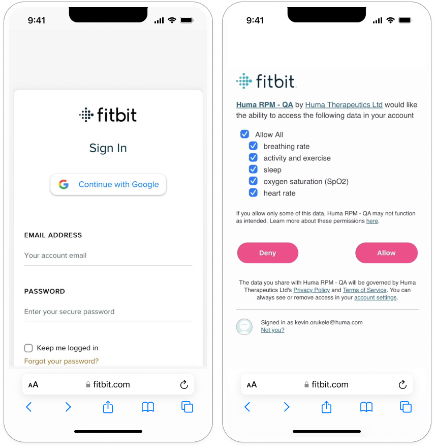
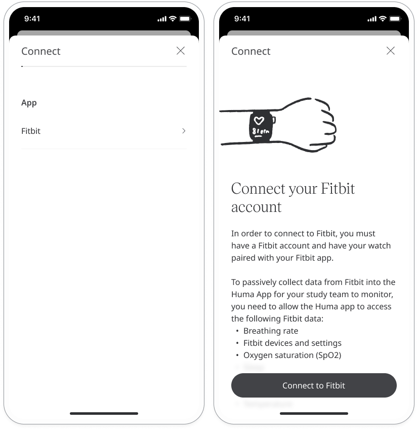
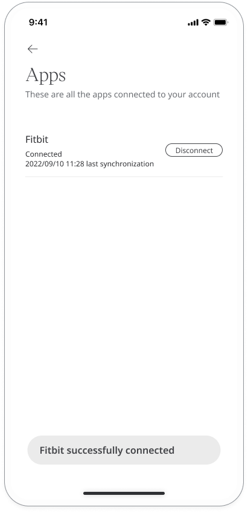

The key function of the Huma App is for collecting patient data and sharing it with care teams. Patients using a Fitbit device can sync this to the app to collect health data for the following modules:
- Heart Rate
- Heart Rate Variability (average HRV value during sleep)
- Steps
- Respiratory Rate (average breaths per minute during sleep)
- SpO2 (blood oxygen levels during sleep)
- Sleep (sleep stages and sleep duration)

The following devices will collect all the data required for these modules: Sense 2; Versa 4; Inspire 3; Charge 5; Luxe; Versa 2.  

## How it works​

To connect your Fitbit to the Huma app, you must have a registered Fitbit account and your watch must already be paired with the Fitbit app on your phone.

Go to your profile and select **Apps**. 

Before you can connect, you will need to allow the Huma app to access Fitbit data. Follow the instructions in the app to allow permissions within the Fitbit app.

Once you have granted permissions, you’ll see a list of devices which are available for pairing. Select Fitbit and then click **Connect to Fitbit** and follow the instructions.

When pairing is completed successfully, you’ll see a success message and your Fitbit will appear on the list of apps.

## Data sync frequency

Once the Fitbit is connected, data will be collected automatically and synced to the Huma app at the following intervals:

- Heart Rate - Hourly
- Heart Rate Variability - Once every 24 hrs
- Steps - Hourly
- Respiratory Rate - Once every 24 hrs
- SpO2 - Once every 24 hrs
- Sleep - Once every 24 hrs

## Intended use

Unless otherwise specified, Fitbit products and services are not medical devices, and are not intended to diagnose, treat, cure or prevent any disease. With regard to accuracy, Fitbit has developed products and services to track certain wellness information as accurately as reasonably possible. The accuracy of Fitbit’s products and services is not intended to be equivalent to medical devices or scientific measurement devices.  This should be clearly communicated to the client prior to deployment.

**Related articles**: [Pairing devices](../getting-started/pairing-devices.md)[Entering your health data]((../getting-started/entering-your-health-data.md))
