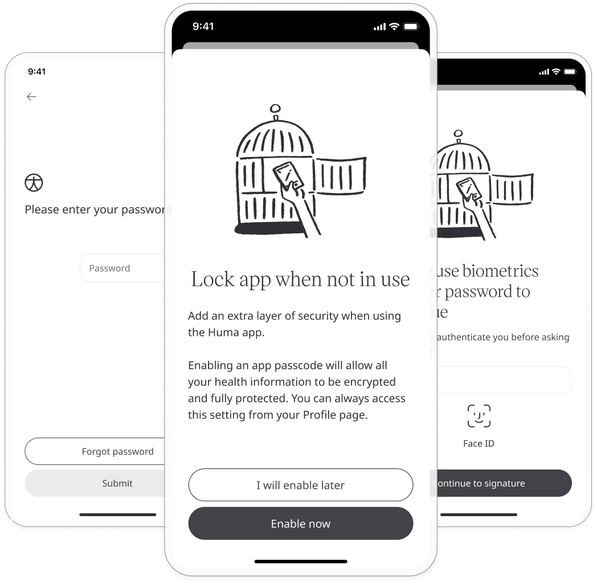
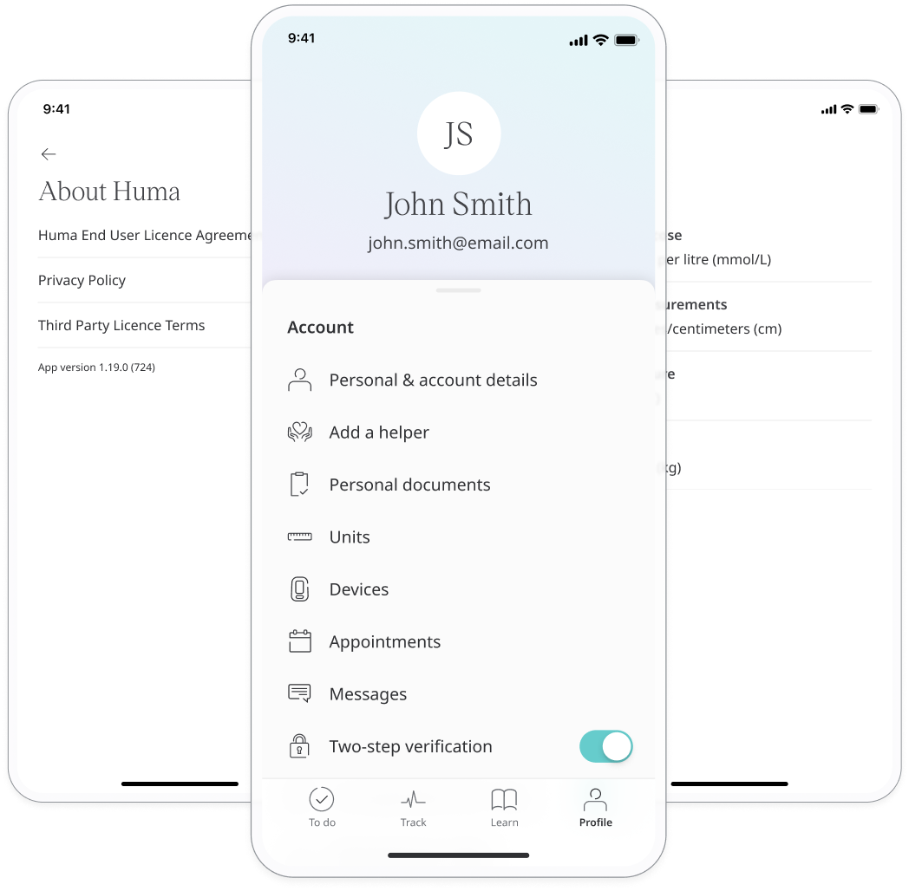

# Data privacy and security features
**User**: Patient

Huma takes the handling of personal health data very seriously. That is why the App uses all means necessary to protect patient data, providing a number of features and settings so that every patient can take steps to help to keep their data safe and secure.

## How it works​

Specific privacy and security features are configured by the Admin user for each Deployment so your setup may contain some or all of the following. 

### Lock app when not in use​

You can enable this toggle to ensure that you have to verify your identity every time you use the Huma App, even if you haven’t closed it down. The type of verification required will depend on the device lock procedure e.g. biometrics or passcode. 

You will be able to decide this when you sign up and can then change the configuration from here in your Profile. 

### Download your data​

Every patient in Huma has a right to their data and you can choose to export it in CSV or PDF format from the Profile page. Select **Download your data** and, on the next screen, just click **Request a download**. The data will take a few minutes to download and you will be informed via a notification once the document is ready.

### Two-step verification​

You can enable this toggle to ensure that you have to verify your identity via a 2-step process when accessing the Huma App. The first verification is with email and password, and the second is via a 4-digit code sent to your mobile number. As such, you must have a working mobile number added to your Profile.

You will be asked to enable this on signup and can then change the configuration from your Profile. 

### Biometric login

Within 2-factor authentication, you can also add **Biometric login**. This means you don’t need to remember your password but can instead use fingerprint or facial recognition to log into the App. The type of biometrics used will depend on the device being used.

If your healthcare provider has enabled biometric login as mandatory, you will be prompted to configure this on signup.

### Legal documentation
Read about how your data is used and terms and conditions of using the app in the **Legal** section of your Profile. Just click **About Huma** to access the documentation.

### Withdrawing Consent​

From inside the Huma App, you can view the eConsent agreement. 

You can easily withdraw your consent at any time without having to search for it or contact a customer support representative. In your Profile, go to **Informed consent form** and simply click the button to **Withdraw your consent**. The Huma App will stop any further data collection.

**Related articles**: [Personal information and account settings](../getting-started/personal-information-account-settings.md); [Configuring the security settings](../../admin-portal/managing-deployments/general-settings/legal-and-security-settings.md)
