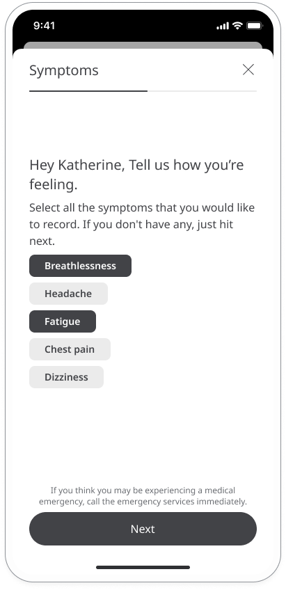

# Entering your health data
**User**: Patient, Helper
- [Adding data manually](#adding-data-manually)
- [Adding data using the camera](#adding-data-using-the-camera)
- [Syncing data from a device](#syncing-data-from-a-device)
- [Adding symptoms](#adding-symptoms)
- [Adding photos](#adding-photos)
- [Responding to questionnaires](#responding-to-questionnaires)

The key function of the Huma App is for collecting patient data and sharing it with care teams. Patients will be reminded via their to do list of data they need to add and can also enter it, as needed, by looking for the module on the Track page.

## How it works​

The **Track** screen is accessed via the  icon on the navigation menu. 

The exact modules and questionnaires on the Track page will depend on the Deployment configuration and are shown as a list of tiles which the patient can view by scrolling. 

Select the module you want to add your data for and click the **Add** button. 

Depending on the type of data being collected you will have the choice of entering it manually, using the camera on your phone or syncing from a connected device.

### Adding data manually

To add data manually, just click the **Add** button and enter the data by inputting it to the text field. The date and time will be automatically set to the current date and time and this should match the time the data was taken. If the data was taken previous to data entry, make sure you set the date and time to match.

### Adding data using the camera

Some health vitals can be collected using the camera on your phone. For example, heart rate can be taken by placing your finger over the camera lens. Open the module and select **Collect from camera** then simply follow the instructions to take your reading. Once complete, it will be recorded automatically with the date and time.

### Syncing data from a device

Some health vitals can be collected via Bluetooth from a medical measurement device such as a blood pressure monitor or a thermometer. 

Make sure your [device is paired](../getting-started/pairing-devices.md) and Bluetooth turned on then open the module or click the item from your to do list.

On the module page, select the option **Take and sync your reading**. 

Follow the instructions on the screen to take your measurement. Instructions may vary depending on the device you are using. Once you have taken your reading, click **Sync** to add the data to the app and share it with your care team. 

You can find a list of your paired devices on your **Paired devices** list.  

### Adding symptoms
The **Symptoms** module lets you keep track of how you are feeling in terms of specific symptoms. Logging your symptoms on a regular basis helps the care team to see patterns and plan your care accordingly.

Open the **Symptoms** module and you will see a list of the symptoms that have been configured for your deployment. Select all of the ones that apply and click **Next**. To deselect a symptom, just click it again.

In the following screens, you will be asked to grade each of the selected symptoms on a sliding scale. Choose the one that best applies in that moment and click **Next**. Some symptoms might ask you for additional information which can be useful for your care team.

Once you have graded all your symptoms and answered any additional questions, you’ll see a summary of your responses. If everything is correct, click **Submit** and your responses will be saved along with the time and date for your care team to review. Click **Done** to return back to the Symptoms page.

### Adding photos
Click the **Photos** module and click **Add** to add your photo. To add your photo directly using the camera on your device, click **Take photo** or 
use the **Photo library** option to select a photo you have already taken on your device.

Once you have added your photo, you can type a note to explain what you are showing, then click **Submit**.

### Responding to questionnaires

Questionnaires allow for more detailed feedback on how you are feeling and give care teams the possibility to assign a score based on your responses.

Select the questionnaire that you want to respond to and click the **Add** button.

You will be presented with a series of questions. Select the answer that best represents how you feel and click **Next**.

Once you have answered all the questions, click **Submit** to share your answers with your care team.

**Related articles**: [Navigating the app](../getting-started/navigating-the-app.md); [Setting reminders](./setting-reminders.md); [Track modules](./track-modules.md); [Pairing devices](../getting-started/pairing-devices.md)
