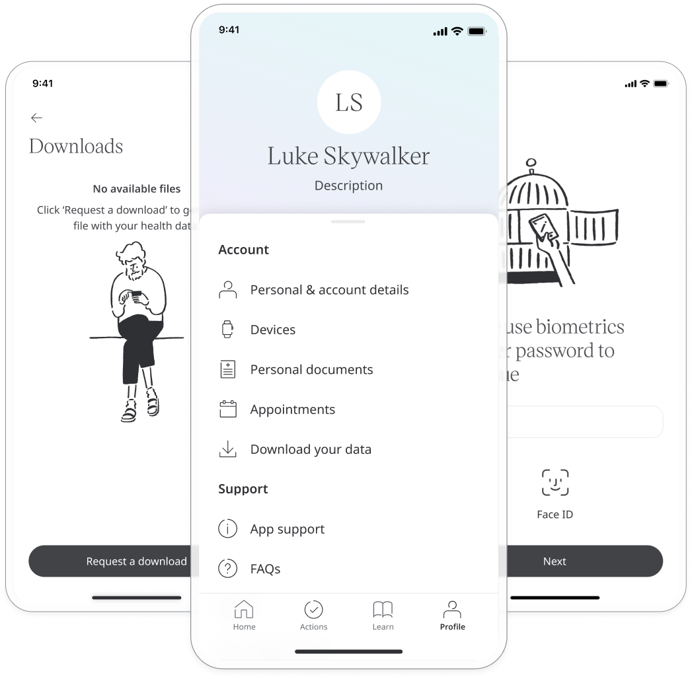
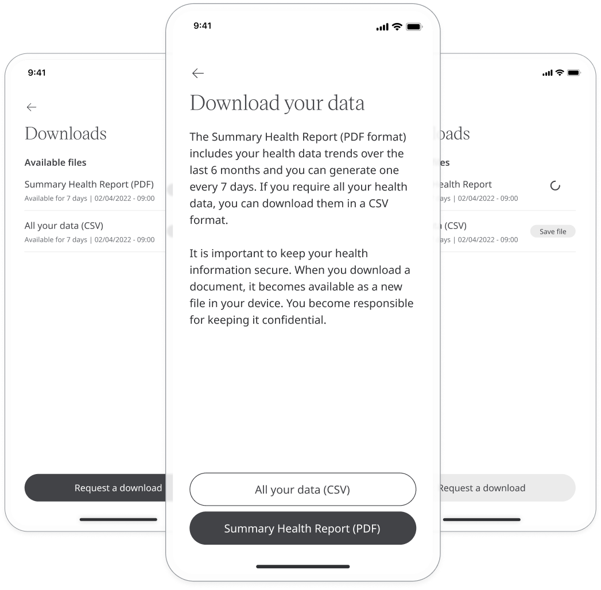

# Health data export 

Huma App lets patients download a summary of their health data for some modules. Downloads and can be requested in either PDF or CSV format. 

## How it works
Data can be exported from the **Profile** section by clicking on **Download your data** then **Request a download**. You will be asked to authenticate the download with biometrics or your password.

Next, click **Summary Health Report (PDF)** or **All your data (CSV)** based on the format required. Once the file is ready to be exported, you will receive a notification and will find a **Save file** button next to the requested formats on the Downloads page. Click the button to download your report.

CSV downloads can be requested as needed and include a record of all the patient's recorded health data.

PDF downloads are structured more like reports, with health data displayed in a more visual format. 

PDF reports are only available for download once every 7 days and are limited to the following modules 
- Weight
- Heart rate
- Temperature
- Peak flow
- Resting heart rate
- Respiratory rate
- Weight and BMI
- Breathlessness
