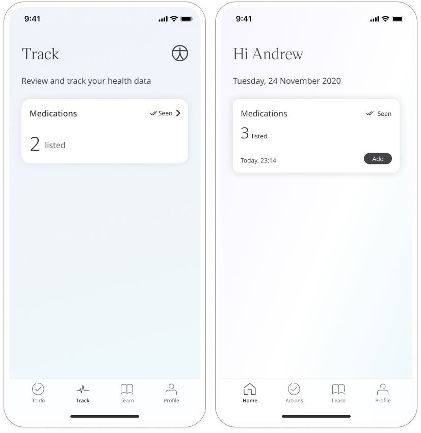
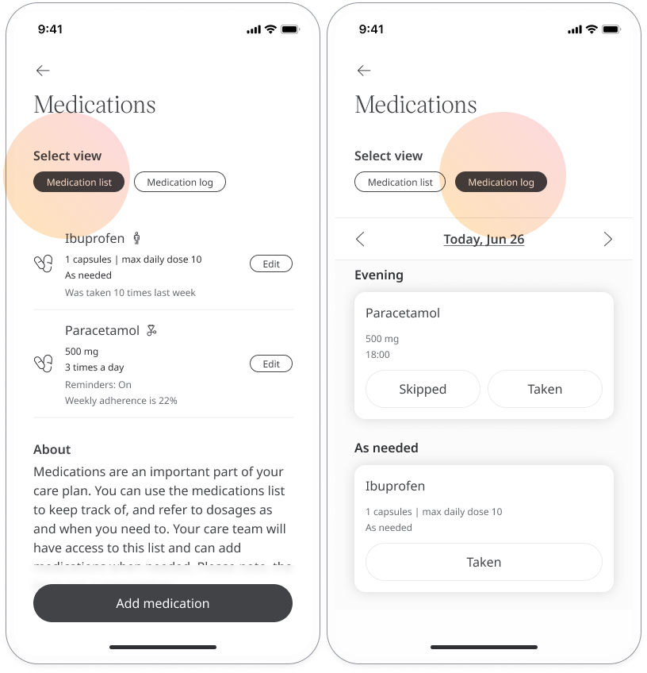
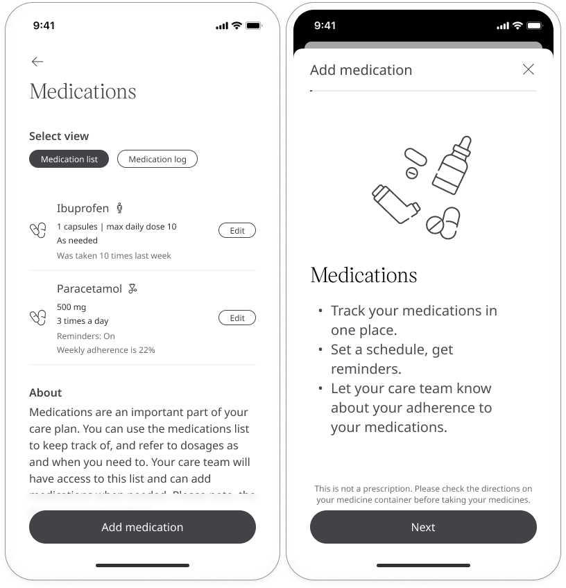
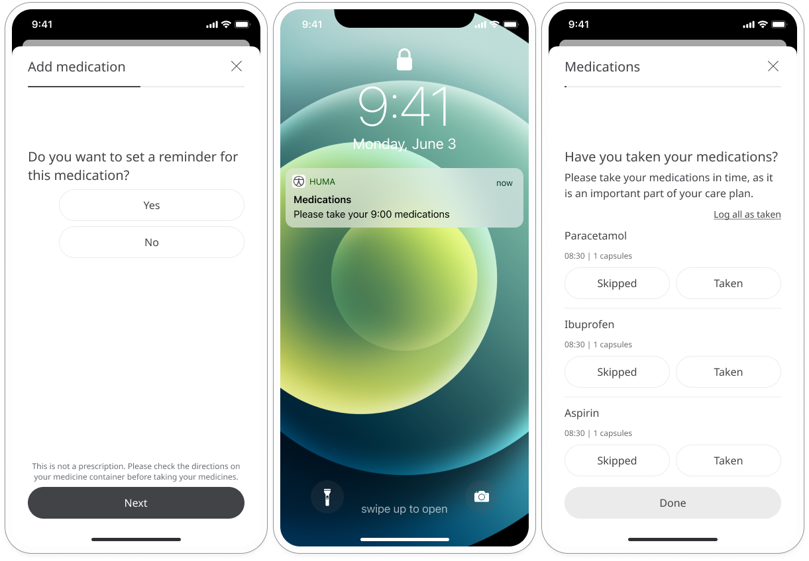
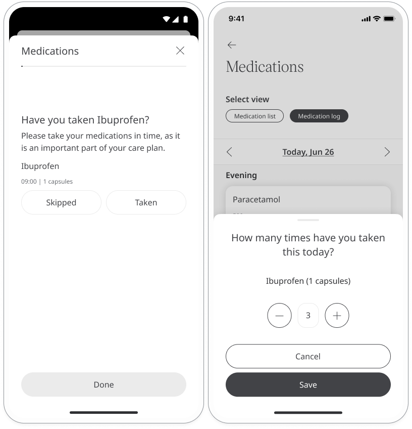
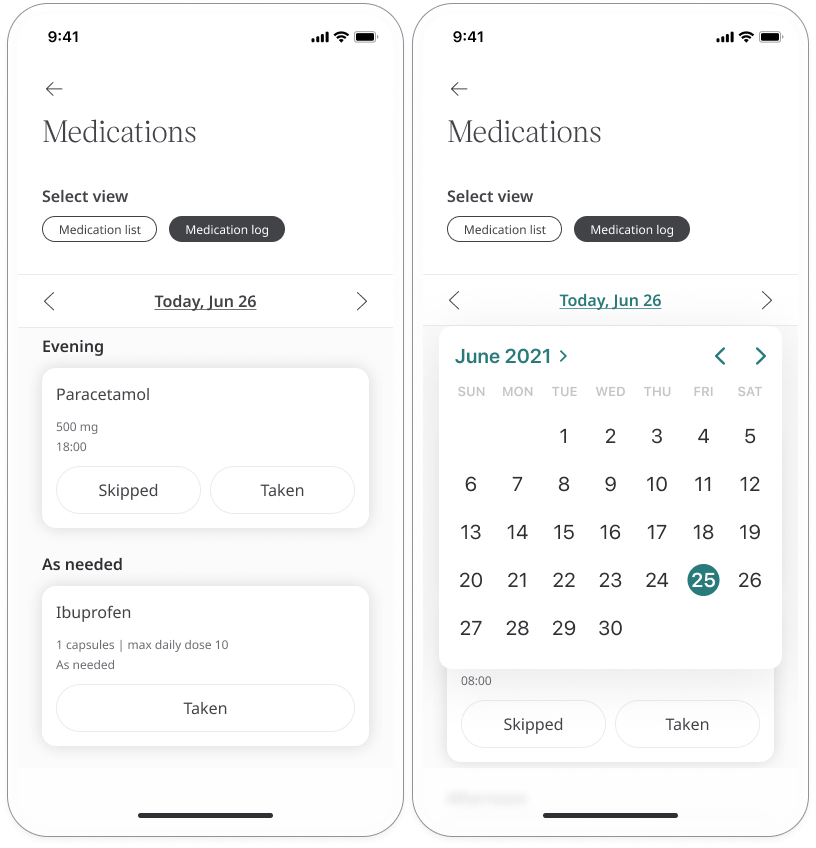
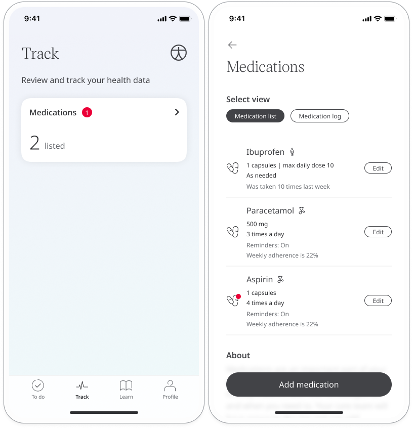

**User**: Patient, Helper

The Huma App not only helps you track and manage your symptoms, but also provides a means to measure these against the medications you are taking. You can follow the medications schedule set for you by your care team and also make changes to it yourself.

## How it works

The **Medications** module is accessed from the **Track** or **Home** page.

You have access to the **Medication list**, which shows all medications added by you or your care team along with their dosage and recommended frequency, and the **Medication log**, which is a record of everything your have taken and when. 

## Adding new medications

From the Medications module, you can add new medications to let your care team know about medications they may not have prescribed directly. Click the **Add medication** button then follow the instructions on the app for entering the name, dosage and frequency. 

## Staying on track

You can set reminders so that you don’t forget to take your medications.  You can set this either when you add a new medication or by editing an existing one.

You will get a notification to your mobile when it is time to take your medication. If you have more than one medication to take, you can click on the notification to see a breakdown of the individual medications and dosages.

You will be asked to record whether you have taken or skipped your scheduled dosage. This lets your care team keep an eye on your adherence and make adjustments where necessary. 

When you see the notification asking whether you have taken your medication, simply click **Skipped** or **Taken** and then click **Done**. If your medication schedule is **As needed**, after clicking **Done**, you will be asked how many times you have taken your dosage.

It’s also possible to record your adherence from the **Medication log** page, where you can log all the medications you have taken or skipped from the whole day.

You can view other days and log adherence. Click the arrows either side of the date to open the calendar then click on the day you want to view.

## Making modifications

You can edit your medications from the **Medication list**. Click the **Edit** button next to the medication you want to edit and you will be taken through the same screens you see when adding a new medication. You can edit the dosage, schedule type and frequency. You can also edit whether you want to receive a reminder. Your care team will be notified about any changes you make to your medications.

If your care team have added a new medication or modified an existing dosage or schedule, you will see a red notification icon on the medication module. Click on the module to see what changes have been made. You will also receive a notification to your mobile when a medication has been added or edited by your care team.

**Related articles**: [Medications module](../../modules/general/medications.md)

