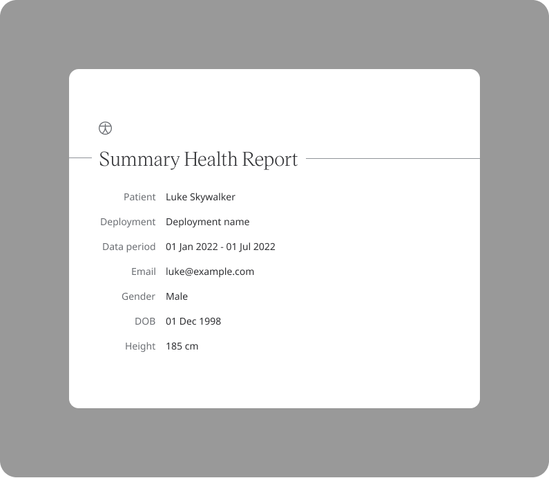
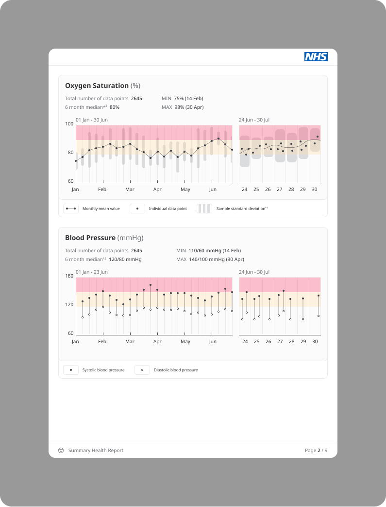

# PDF health summary report 

Huma App enables the patient to download the summary of the health data reported over a period of time in a PDF format. The data is shown in an interactive graphical colour coded format.

## How it works
Data can be exported from the **Profile** section, by clicking on **Download your data**. Then, click **Request a download** after which the download needs to be authenticated with biometrics or password.

Then, click on **Summary Health Report (PDF)** section, by clicking on **Download your data**. The user will be notified after the file is ready to be reported. Click on **Save file** beside the **Summary Health Report (PDF)** and the file will be downloaded.

Here is how a Health summary report looks like:

## Available for the following modules: 
1. Weight
2. Heart rate
3. Temperature
4. Peak flow
5. Resting heart rate
6. Respiratory rate
7. Weight and BMI
8. Breathlessness
