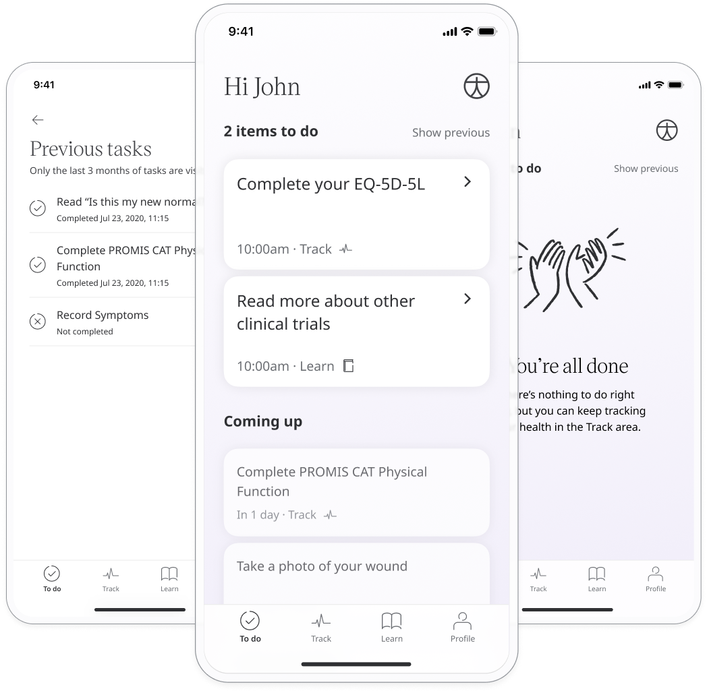

# To dos
**User**: Patient, Helper

The Huma Care App aims to simplify the process of health data tracking even when collecting multiple data points from patients. The **To do/Timeline** page is a place where patients can find their upcoming priority tasks. 

## How it works​

The To do/Timeline screen is where you land when you [log into the Huma Care App](../getting-started/login-and-onboarding.md). The tasks that appear here are based on specific tasks set by your care team.

The To do list will be ordered according to priority and you will be able to see the date each task became active. Once the task is complete (or expires) it will disappear from the timeline. The main list will include the top priority tasks and those coming up over the next two weeks. The **Previous** list will show previous tasks up to 3 months in the past. 

Pending appointments are also displayed here when they require confirmation, as well as confirmed appointments which are upcoming.

Besides the To do list, which lets you see your top priority tasks from within the Huma Care App, you can also [configure your own reminders](./setting-reminders.md) from within the modules so that you get push notifications. 

**Related articles**: [Track modules](./track-modules.md); [Setting reminders](./setting-reminders.md); [Configuring patient to dos](../../admin-portal/managing-deployments/configuring-the-content/patient-to-dos.md)  
