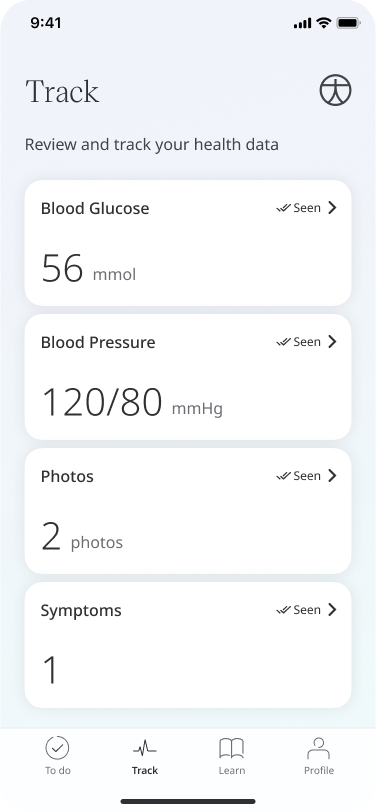
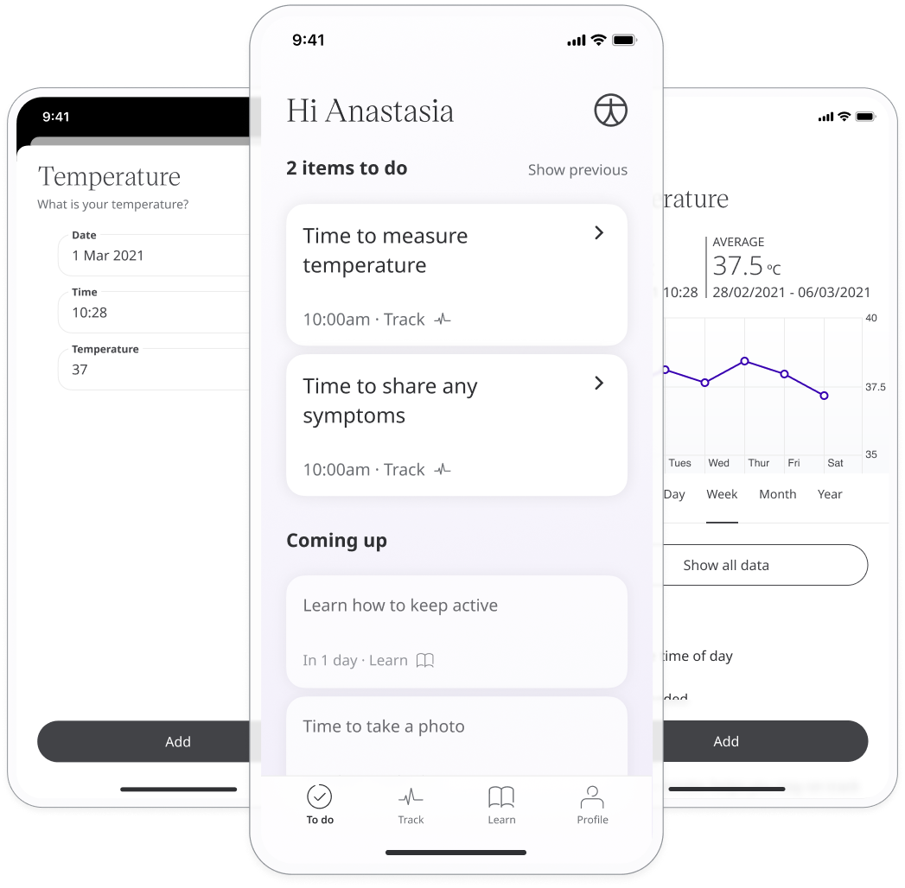

# Track modules
**User**: Patient, Helper

The key function of the Huma Care App is for collecting patient data and sharing it with care teams. The Track screen is where patients can access all of the modules assigned to them by their care team.

## How it works​

The **Track** screen is accessed via the  icon on the navigation menu. 

The module tiles show the most recent entry recorded. Below that you can see the recommended schedule and the date and time of the last entry. Click the tile to see more information or [enter new data](./entering-your-health-data.md).

### Historic data
If data is available, you will see a chart at the top of the module showing all your past data points mapped onto the graph. At the top of the graph you will see the average reading alongside the most recent, with the date of your last reading. 

You can change the time frame shown by clicking the options on the horizontal axis, showing data across the past **year, month, week, day** or **hour**. Click **Show all data** to see all your past readings in list form.

In the case of non-scored questionnaires or symptoms modules, you won’t see a graph. Click **Previous entries** to see past responses to these modules. 

### Schedule

The schedule tells you the recommended frequency and time of day for you to take your readings.

### Reminders

You can [set your own custom reminders](./setting-reminders.md) based on the recommended schedule so that you get a push notification to remind you to record your data.

### Assigned Learn content

Your care team may assign articles from the [Learn centre](./learn.md) which relate to the health data being collected. Just click the link to open the article or video.

### About
You can find information about the module that the care team has left for you. This might include an explanation of the vital being collected and recommendations for optimal data collection.

**Related articles**: [Entering your health data](./entering-your-health-data.md); [Setting reminders](./setting-reminders.md); [Using the Learn centre](./learn.md)
