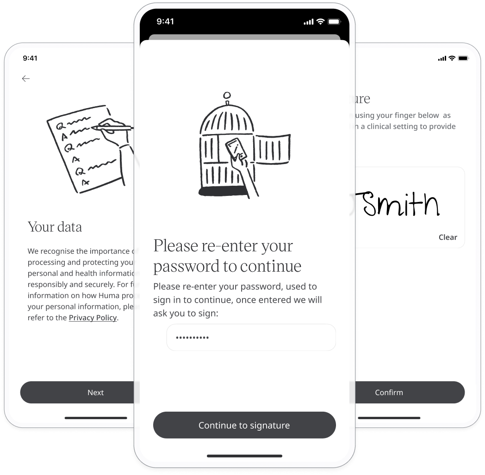
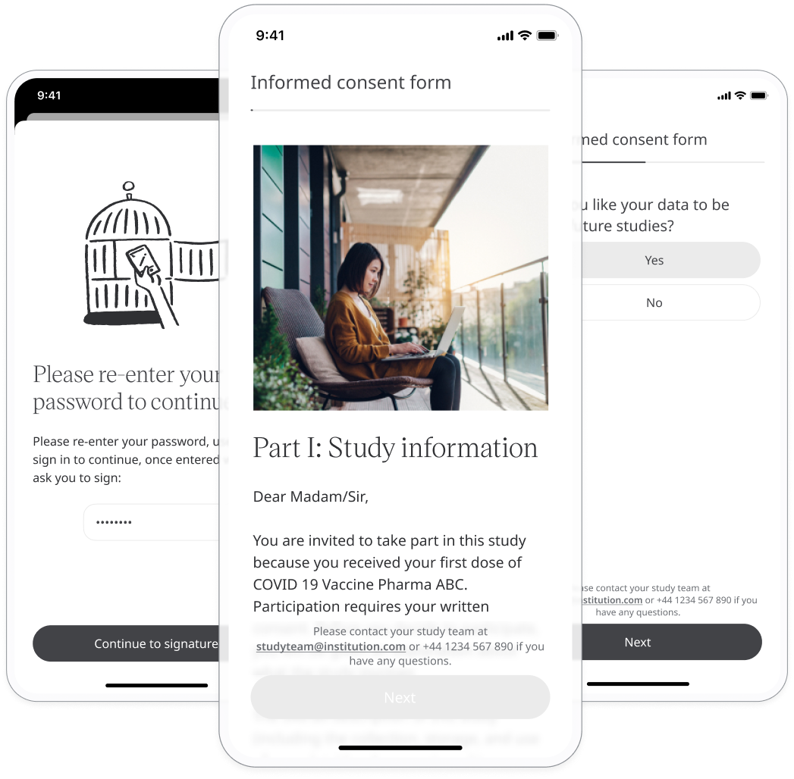
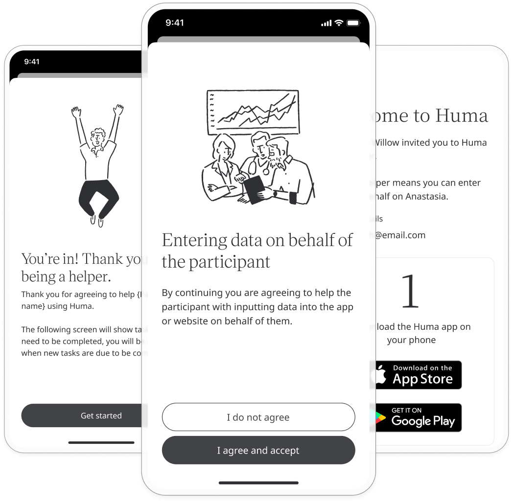

# Login and onboarding
**User**: Patient, Helper

The Huma sign-up process is intuitive and accessible, enabling patients, and people involved in clinical trials to easily create their account and get started.

The onboarding steps are configured so that all the essential information is collected from the patient at the outset, ensuring all their needs and capabilities are accounted for.
## How it works​
You will be invited to the Huma Care App by email or direct link from your care team. 
### Login

The email will give you the direct iOS and Android links to download the Huma Care App. 

After downloading the Huma Care App, you will be able to create your account by clicking **Activate Account** in the email on your mobile device.

> ⚠️ **INFO**: If you're signing up via direct link, you will have to enter your email address and verify it by entering a 6-digit code sent from your care team.

After clicking **Activate Account** or passing through the verification process, you will go to the password screen where you can create your account password. Passwords must be alphanumeric, with at least 8 characters including upper and lowercase. 

If 2-step verification has been configured, you will also need to enter a 6-digit code sent to your mobile number. You can turn [2-step verification](../features/data-privacy-and-security.md) on or off from your Profile for future logins.

You can pause 2-factor authentication by checking the box **Remember me for 14 days**.

### Onboarding

The onboarding process consists of a number of screens that will ask you for information, consent or preferences on using the Huma Care App. The exact onboarding steps will depend on the Deployment configuration. Once you have completed all the steps, you can access the Huma Care App features. 

### Data processing agreement
As the Huma Care App allows the collection of data from patients, you must provide informed consent to Huma as part of the terms and conditions of using the Huma Care App.

You will be taken through the terms and conditions and finally asked to consent by checking a box. 

### ID Verification
In some cases, it is important to confirm that the person using the Huma Care App is the person entering the details. ID verification is an onboarding step that is used to ensure the right person is logging in to a particular Deployment.

There are two possible steps to identity verification - documentation and facial recognition. With the first step, you will need to photograph a form of ID such as a passport or national identity document. The second step is to take a photo of your face. It should take around 60 seconds to complete the verification process and you will be informed via push notification once the process is complete.

### eConsent
If you are taking part in clinical trials, you will be required to read the patient information leaflet which contains information about the trial and confirm your compliance by signing the electronic informed consent form. 

On receipt of your signature, Huma will generate an electronic informed consent form(eICF) PDF which you can download from your Profile under **Informed consent form**.

You can withdraw your consent at any time from your [Profile](../features/data-privacy-and-security.md).

### Helper agreement
You can allow another party to manage data entry on your behalf if you are unable to use the Huma Care App yourself. 

You or your care team can invite helpers. Once helpers receive their invite, they are prompted to download the Huma Care App and are taken through the sign up and onboarding process. This includes the Helper Agreement, in which they must agree to entering data on your behalf. Once in the Huma Care App, helpers can enter data into modules in the same way that a patient would.

### Biometric Login​
Biometric login offers an alternative to password login, something which can be very useful for patients with memory difficulties or mobility issues.

Depending on the device being used, biometric login could be via fingerprints or facial recognition and is something that you can set up as part of the onboarding if the Deployment is configured in this way. 

Biometrics is just one of the data security settings that you can manage from your **Profile** page under **Account**. On enabling the **Two-step verification** toggle, you will be able to set up your biometric login.

### Profile Questionnaire
The Profile Questionnaire asks you for some basic information that will be used to populate your Profile. The exact data requested will depend on your [Deployment configuration](../../admin-portal/managing-deployments/configuring-the-user-profile/user-profile-details.md).

**Related articles**: [Onboarding setup](../../admin-portal/managing-deployments/configuring-the-user-onboarding/onboarding-setup.md); [Privacy and security settings](../features/data-privacy-and-security.md); [eConsent](../../admin-portal/managing-deployments/configuring-the-user-onboarding/econsent.md); [Data consent](../../admin-portal/managing-deployments/configuring-the-user-onboarding/data-consent.md); [Identity verification](../../admin-portal/managing-deployments/configuring-the-user-onboarding/identity-verification.md); [Preferred units](../../admin-portal/managing-deployments/configuring-the-user-onboarding/preferred-units.md); [Helper agreement](../../admin-portal/managing-deployments/configuring-the-user-onboarding/helper-agreement.md) 
