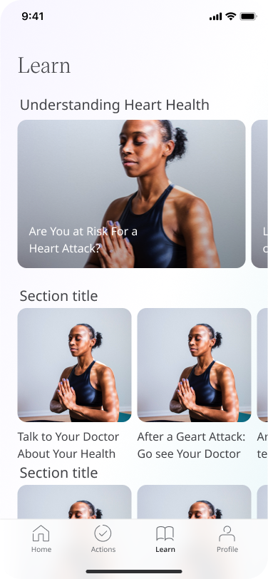

# Navigating the App
**User**: Patient, Helper

The main objective of the Huma App is to give patients the ability to record their health data and self-observations so that these can be shared with care teams, helping them to manage their general health and specific conditions.

# How it works​

Depending on the app configuration, there will be up to four different areas, accessible via the navigation menu at the bottom.

The default homepage is usually the [To do/Timeline](../features/to-dos.md) page. This is where you will see any actionable items assigned to you by the care team, such as appointment requests, Learn content, or modules pending data collection.

The [Track](../features/track-modules.md) page is where you can find a list of all your assigned modules and questionnaires. You can find information about the modules [set specific reminders](../features/setting-reminders.md) for entering your data. 

The [Learn](../features/learn.md) area provides further reading and insights. Browse the content in the Learn area at any time or wait for specific recommendations from your care team. 

The Profile page is where you can find and [edit your personal data](./personal-information-account-settings.md), access [privacy and security settings](../features/data-privacy-and-security.md), invite helpers, access [messages](../features/messages.md) and log out of the app.

**Related articles**: [Login and onboarding](./login-and-onboarding.md); 
