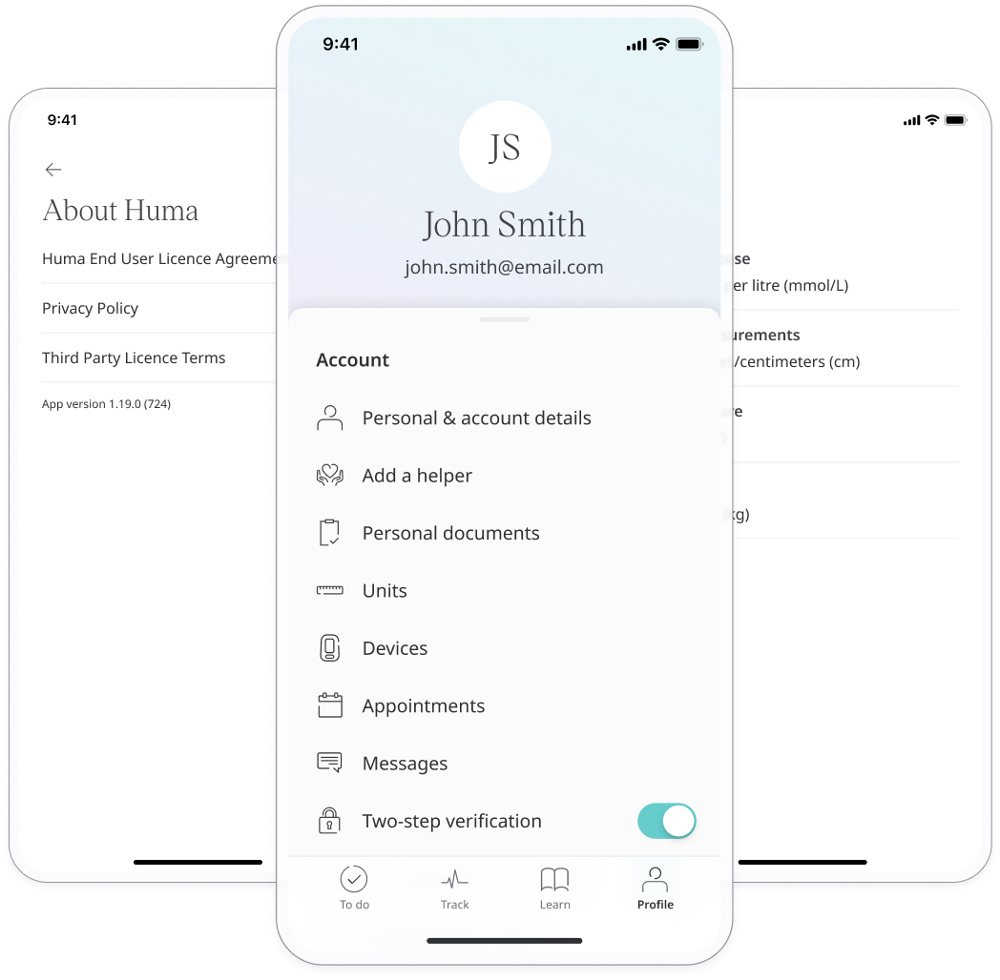
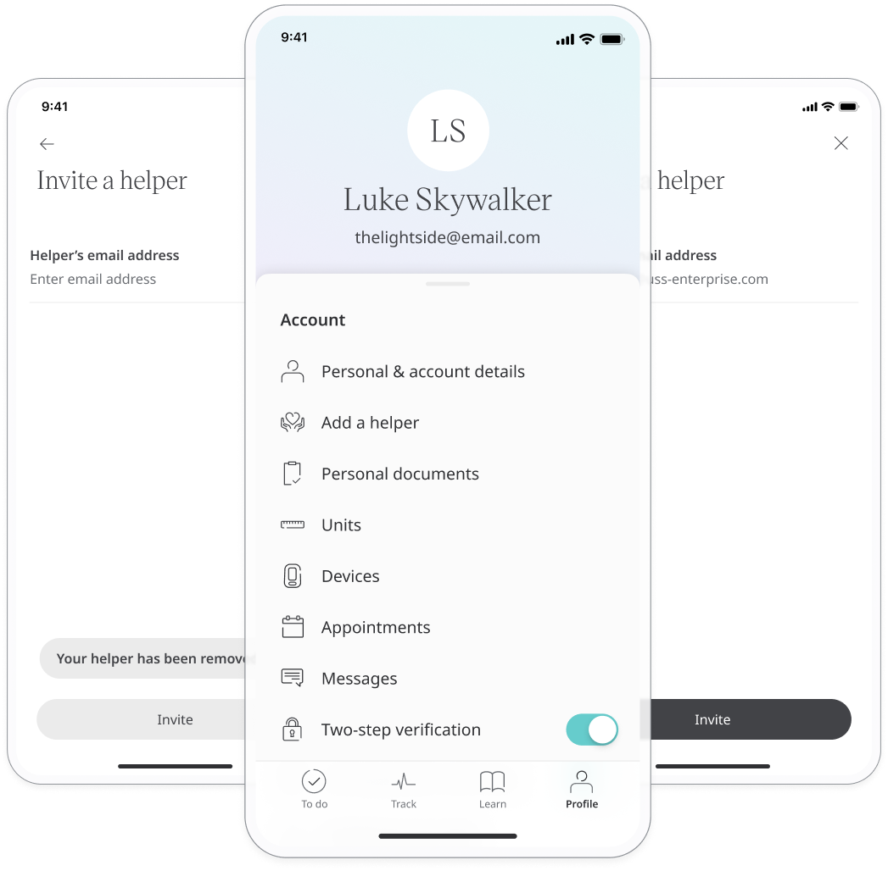
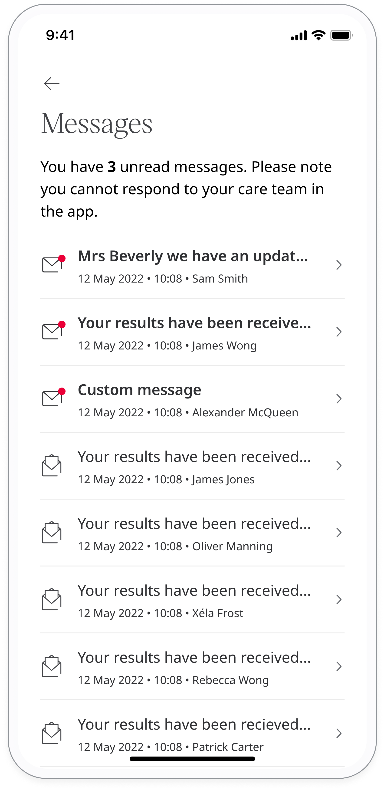

# Personal information and account settings
**User**: Patient, Helper

The **Profile** screen contains the patient’s personal information along with some account settings. It can also be used to access some of the Huma App’s customisable features. The exact contents of the Profile screen will depend on the Deployment configuration.
## How it works​
Access your **Profile** screen from the navigation menu. 

### Personal & account details​

You can access and edit your basic personal information that was collected during onboarding. This might include name, gender, DoB, ID number, etc. 

You can also edit the mobile number used for 2-factor authentication and can change your password here. After making any changes, click **Save** at the top of the page.

### Add a helper

If you have this feature in your Profile it means you can invite someone to manage data entry in the Huma App on your behalf. 
1. Select **Add a helper** from your Profile.
2. Click **Continue**.
3. On the next screen, enter the helper’s email address and click **Invite**.

Your helper will receive their invite which will ask them to download the Huma App and create their account. Once they have been through the sign up and onboarding process, they can enter data into the modules on your behalf.

### Preferred units​
You can decide which units you would like to use for measuring different vitals. 

In **Units**, select the metrics that are being measured in the Huma App and choose the unit of measurement that you prefer to use. This will affect both how the data is collected and displayed to you. 

The selected measurement unit will appear below each metric.

### Personal documents​

If you receive documents relating to your healthcare e.g. vaccination certificates, you can upload them to the Huma App via the **Personal Documents** feature.

From the **Personal Documents** screen, just select **Add new document**. You will be prompted to select a PDF or photo from your device.

### Messages and Appointments
You can access your [messages](../features/messages.md) and [appointments](../features/calls-and-appointments.md) from your Profile. 

### Health summary data export
You can download the summary of health data that was tracked over a period of time in a PDF or CSV format. 

### Data privacy and account settings
There are a number of features and settings in your Profile to help keep your data safe and secure. See the [data privacy and account security](../features/data-privacy-and-security.md) article for more details.

### App support​
If you have the **App support** feature available in your Profile, click to access live chat or support documentation.

### Logout
To log out of the Huma App, scroll down to the bottom of the Profile page and click **Logout**. You will be returned to the login screen.

**Related articles**: [Personal information and account settings](./personal-information-account-settings.md); [Data privacy and account security](../features/data-privacy-and-security.md); [Managing calls and appointments](../features/calls-and-appointments.md); [Messages](../features/messages.md) ; [Health data export](../features/Health-data-export.md)
