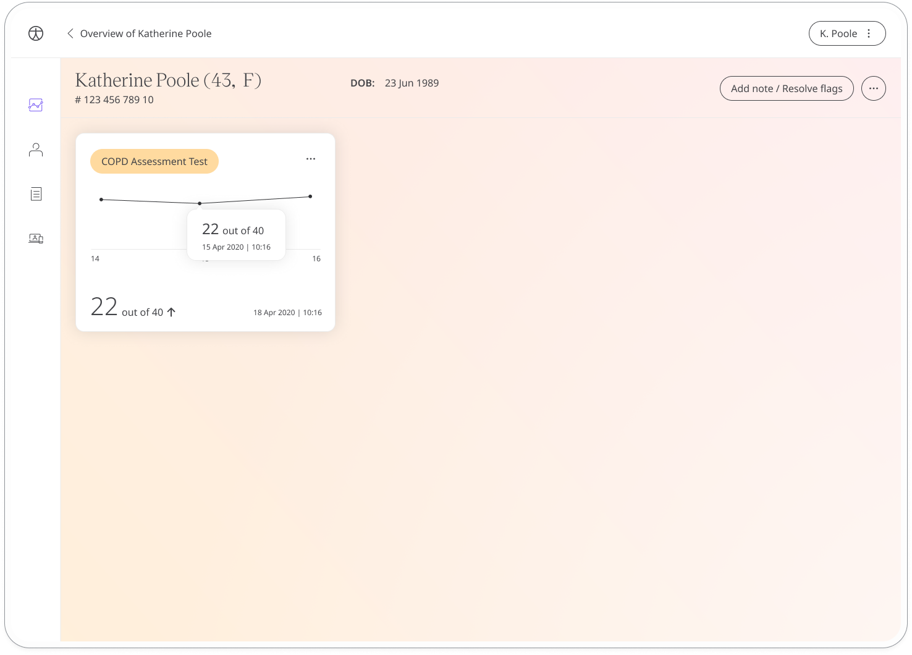

The COPD assessment test is a licensed questionnaire where patients make a self-assessment about their current state of well being to help their care team to asses the impact chronic obstructive pulmonary disease is having on their daily life. 

## How it works

Patients answer questions about coughing, breathlessness and their levels of activity. Questions are scored on a scale from 1-5 which is shared with care teams via the Clinician Portal. The assessment uses computerised adaptive testing (CAT) which means the questions adapt to the user's ability level. 

To start, patients select the COPD module and click **Add**. When they have answered all the questions, they will be assigned a score that is shared with their care team. From within the module, patients can view their progress in a graph and also access all their previous results. Daily, weekly, or monthly reminders can be set to help stay on track.

In the Clinician Portal, care teams will see the latest COPD assessment test score for their patient, with concerning scores flagged for attention.

The Patient Summary displays a more detailed view of the patient's historic readings in graph or table form.

