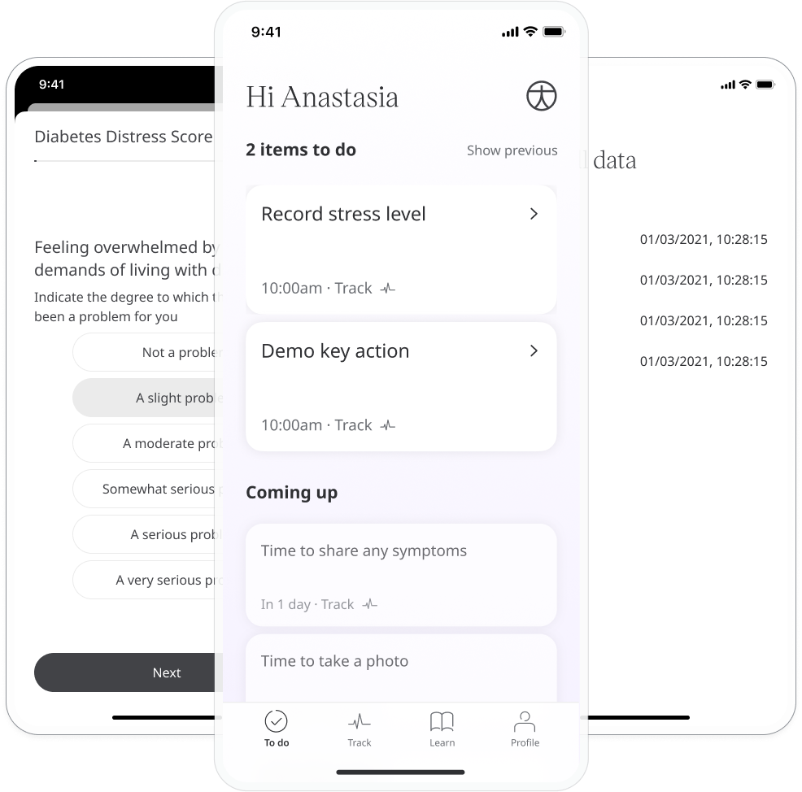
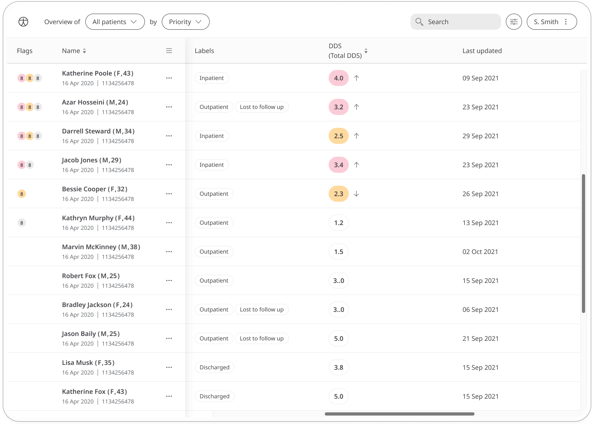
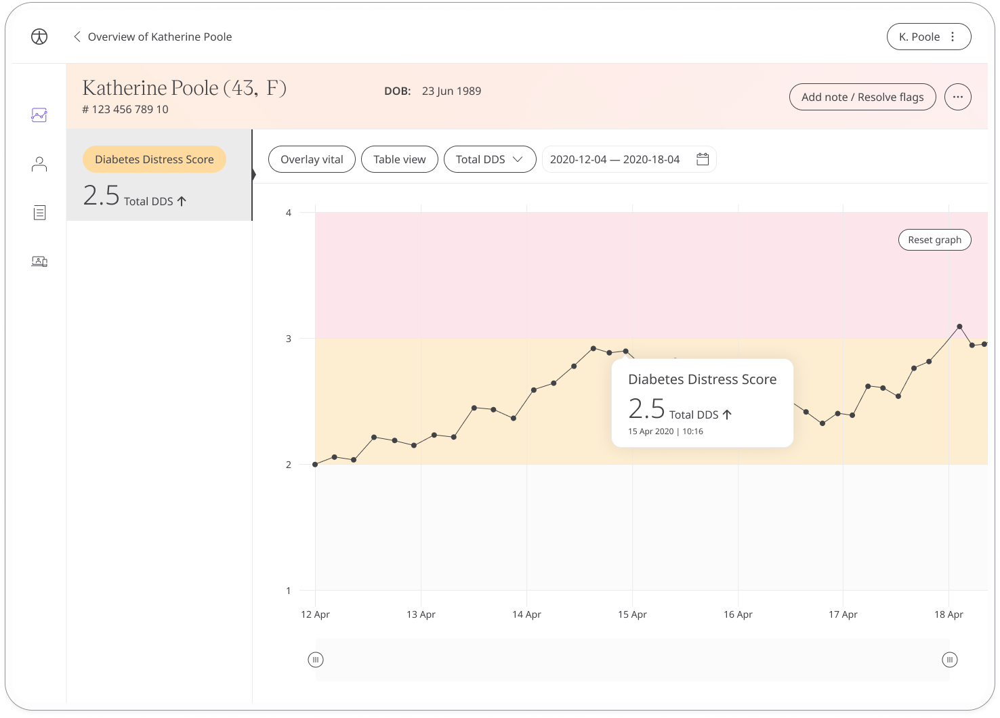

Living with diabetes comes with challenges, so keeping track of how patients feel while managing their condition is an important part of their healthcare. Huma provides the diabetes distress score questionnaire so patients can report their well being to care teams to help manage their diabetes.

## How it works

The diabetes distress score questionnaire gives patients with diabetes a way to reflect on their wellbeing through a series of subjective questions, such as “Do you feel overwhelmed by the demands of living with diabetes”. They can choose from a set of multiple-choice responses to indicate the severity in each case.

From the Diabetes Distress Score module, patients can start the questionnaire by clicking **Add**.

Patients can view their progress in a graph and view all previous results in a table. Patients can also set a daily, weekly, or monthly reminder to help keep on track.

In the Care Portal, care teams will see the latest diabetes distress score for their patient, with concerning scores flagged for attention.

 In the Patient Summary, care teams will be able to see all historical data in graph or table form.
 

This questionnaire can be used in conjunction with the [Norfolk Quality of Life-Diabetic Neuropathy](./qol-dn.md) questionnaire.
