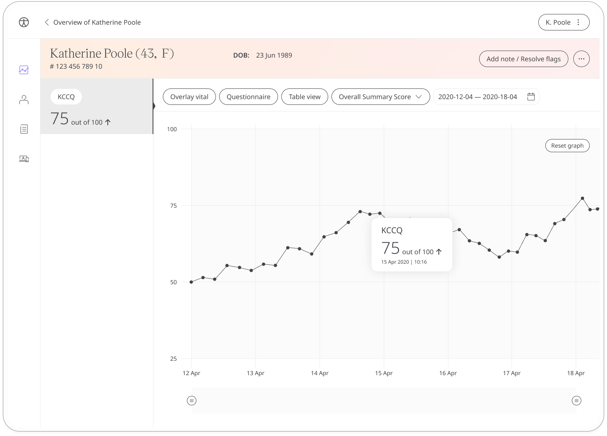

Heart failure is a complex chronic condition that presents debilitating symptoms which can impact on daily life. The Kansas City cardiomyopathy questionnaire assesses how patients manage their condition so they can work together with their care teams to to improve outcomes and quality of life.

## How it works

Patients answer questions about how living with a heart condition impacts their quality of life, both physical and social. The Kansas City cardiomyopathy questionnaire has no right or wrong answers and takes around 4-6 minutes to complete.

From the KCCQ module, patients can start the questionnaire by clicking **Add**. They can view their progress in a graph and also access all their previous results. Daily, weekly, or monthly reminders can be set to help keep patients on track.

In the Care Portal, care teams will see the latest KCCQ score for their patient, with concerning scores flagged for attention.

In the Patient Summary, care teams will be able to see all historical data in graph or table form.

