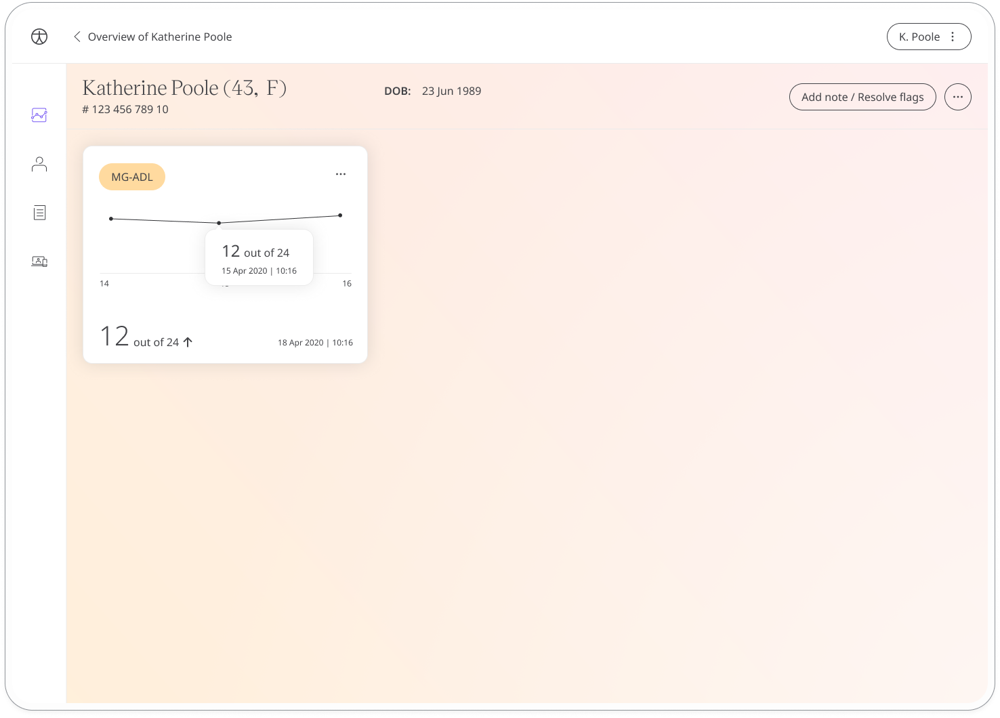
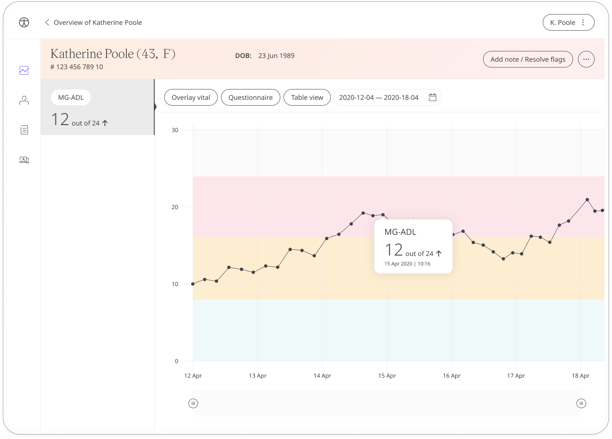

The myasthenia gravis activities of daily living (MG-ADL) questionnaire is a quality-of-life PROM questionnaire where patients make a self-assessment about their current level of health. The questionnaire allows patients to use the Huma app to evaluate the impact of 8 key symptoms of myasthenia gravis on their daily life and share their responses with care teams in order to make more informed decisions about their healthcare.

## How it works

Patients are asked about 8 different symptoms of MG, including speech, swallowing, breathing, and eyelid droop. They are asked to rate the severity of each symptom from 0-3. The responses are converted into a score out of 24, with higher scores indicating a higher severity of symptoms.

To start, patients select the MG-ADL module and click **Add**. When they have answered all the questions, they will be assigned a score that is shared with their care team. From within the module, patients can view their progress in a graph and also access all their previous results. In addition, daily, weekly, or monthly reminders can be set to help stay on track.

In the Clinician Portal, care teams will see the latest MG-ADL score for their patient, with concerning scores flagged for attention.

The Patient Summary displays a more detailed view of the patient's historic readings in graph or table form.

