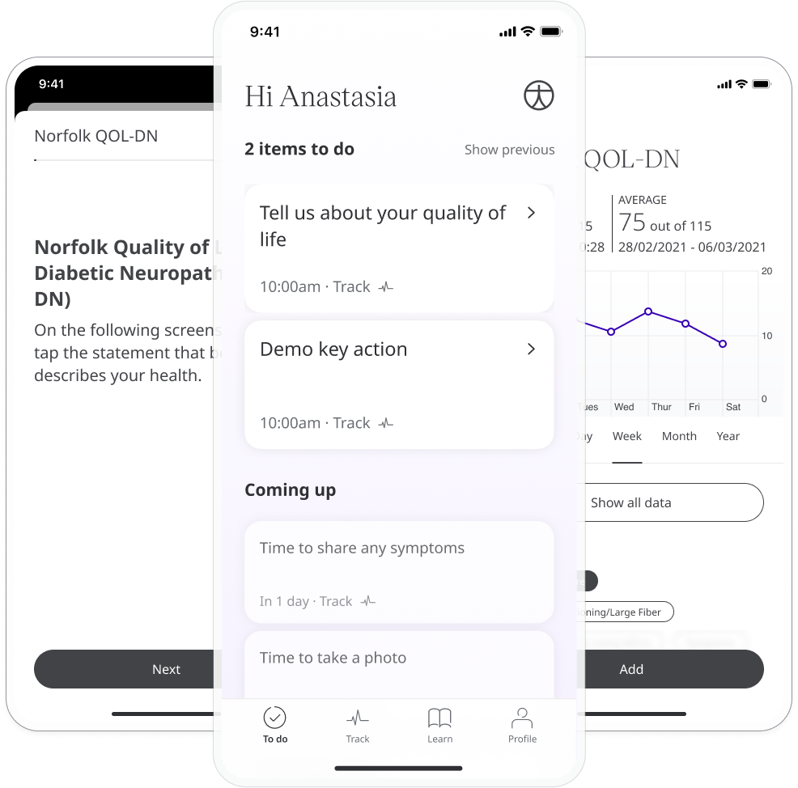
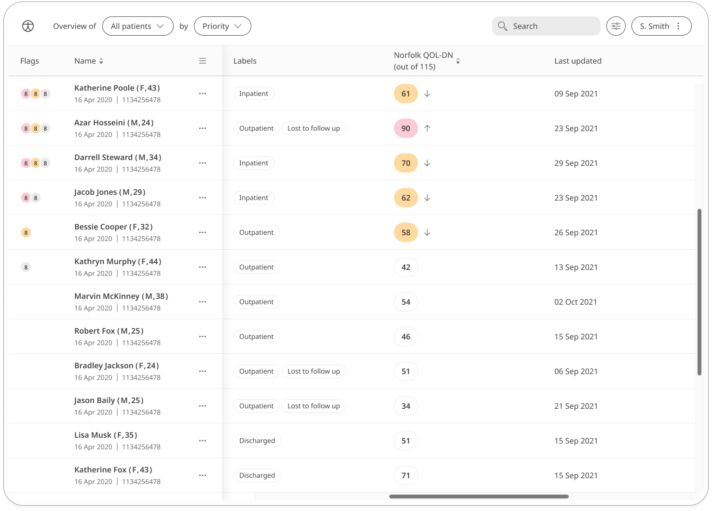
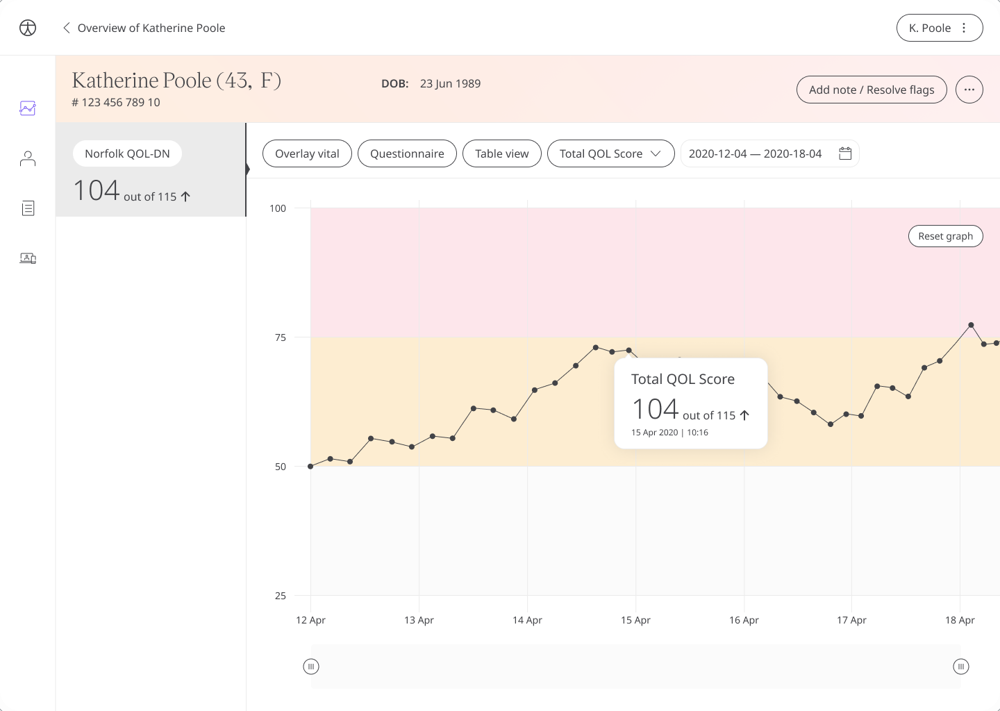

Diabetic neuropathy is a type of nerve damage that can occur if you have diabetes, and Huma provides the Norfolk quality of life-diabetic neuropathy (QOL-DN) questionnaire to capture the effects of diabetic neuropathy and how it affects daily activities. Care teams can view the results to gain insight and provide care to patients.

The Norfolk quality of life-diabetic neuropathy questionnaire allows patients to reflect on their quality of life through 35 questions. From the Norfolk QOL-DN module, patients can start the questionnaire by clicking **Add**.

Patients can view their progress in a graph and view all previous results in a table. Patients can also set a daily, weekly, or monthly reminder to help keep on track.

In the Huma Portal, care teams will see the latest QOL-DN score for their patient, with concerning scores flagged for attention.

 In the Patient Summary, care teams will be able to see all historical data in graph or table form.

This questionnaire can be used in conjunction with the [Diabetes Distress Score Questionnaire](./diabetes-distress-score.md)
