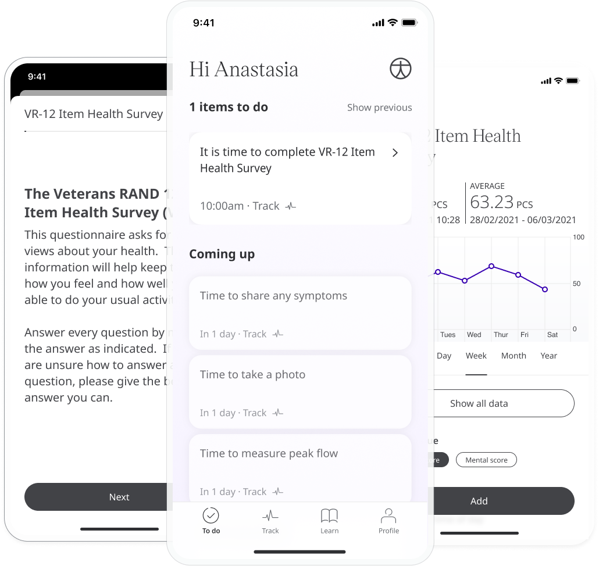
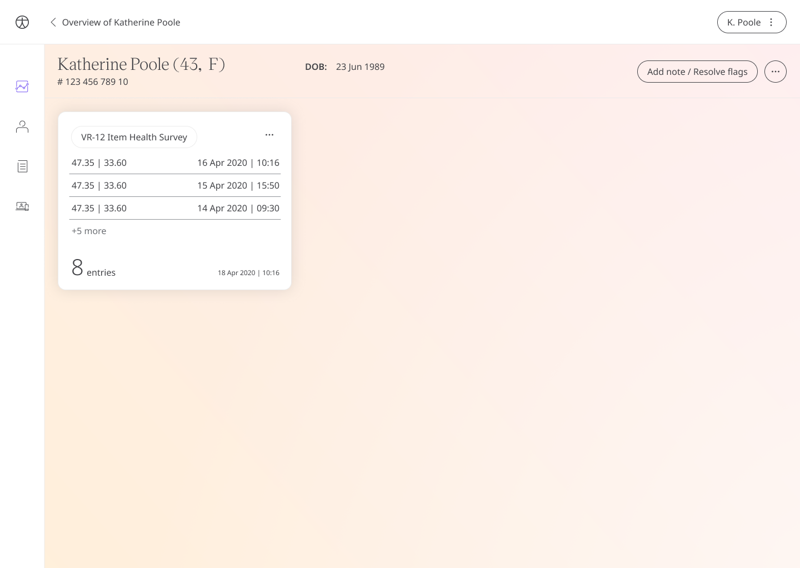
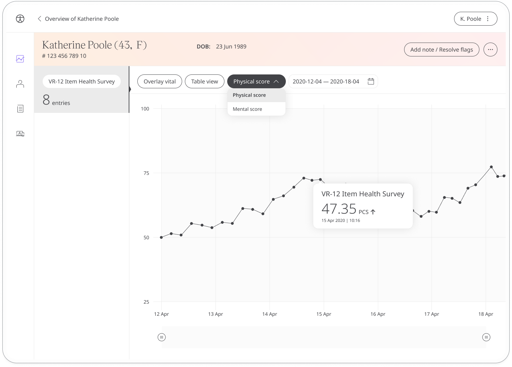

The Veterans RAND-12 health survey is a licensed quality-of-life PROM questionnaire where patients make a self-assessment about their current level of health. The questionnaire allows patients to use the Huma Care App to continually evaluate their quality of life and share their responses with care teams in order to make more informed decisions about their healthcare.

It is also a valuable tool in research that could be used to measure, compare and value health status across disease areas.

## How it works

Patients answer questions about their level of activity, energy, pain/discomfort, and anxiety/depression. Some questions are scored on a scale while others are more qualitative. The responses are converted into an index value between 1-5 which is shared with care teams via the Care Portal.
To start, patients select the VR-12 module and click **Add**. When they have answered all the questions, they will be assigned a score that is shared with their care team. From within the module, patients can view their progress in a graph and also access all their previous results. Daily, weekly, or monthly reminders can be set to help stay on track.

In the Care Portal, care teams will see the latest VR-12 score for their patient, with concerning scores flagged for attention.

The Patient Summary displays a more detailed view of the patient's historic readings in graph or table form.

