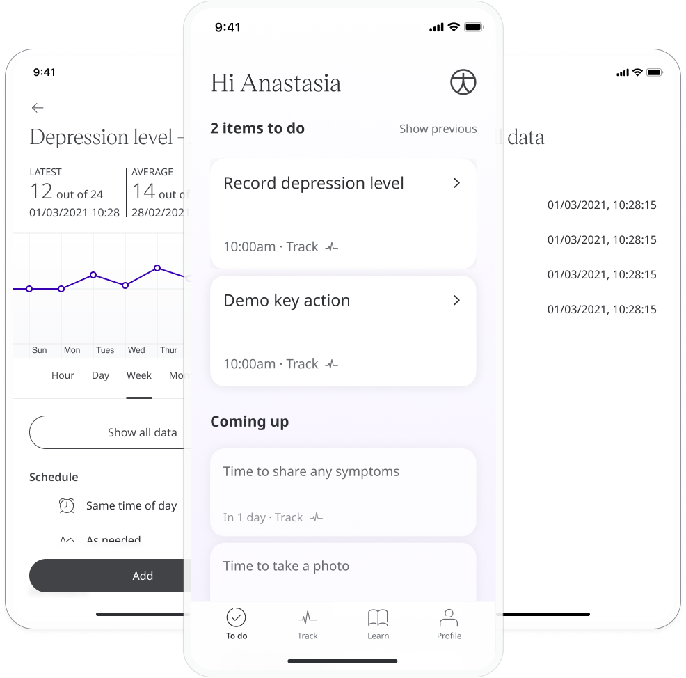
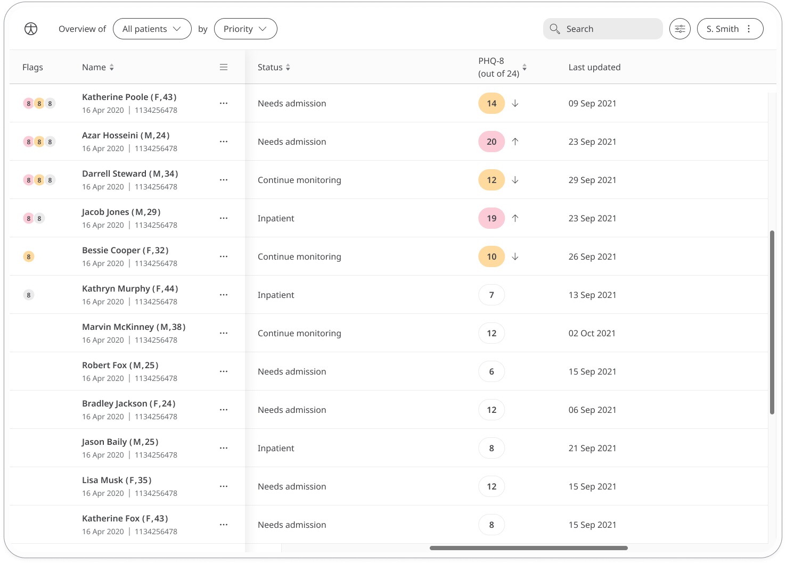
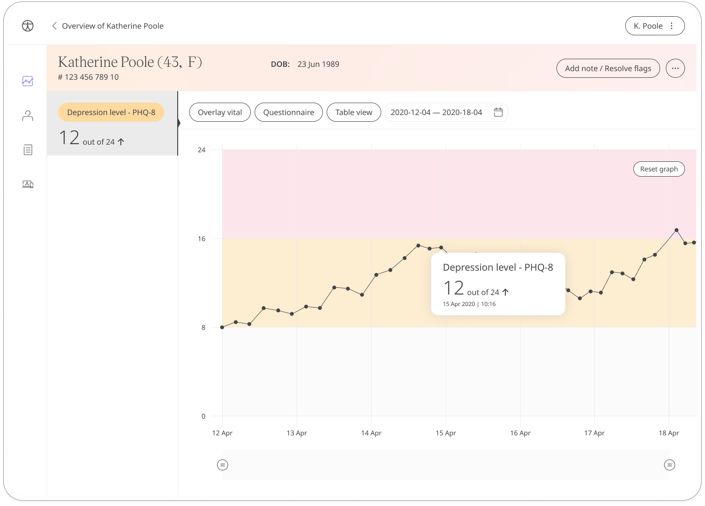

Depression is a mental health issue experienced widely throughout our society and can have a significant impact on how a person navigates their daily life. The patient health questionnaire depression scale (PHQ-8) screens for and measures the severity of depression. Results are shared with care teams who can work with patients to provide the care that is needed.

## How it works

The PHQ-8 questionnaire is a quick and effective depression assessment tool for care teams. Patients respond to questions that ask how they have been feeling over the last two weeks, such as “Do you find little interest or pleasure in doing things?”. They answer from a set of multiple choice options that measure the scale of their depression:
- Not at all
- Several days
- More than half the days
- Nearly every day

To start, patients select the Depression Level - PHQ-8 module and click **Add**. When they have answered all the questions, they will be assigned a score that is shared with their care team. From within the module, patients can view their progress in a graph and also access all their previous results. Daily, weekly, or monthly reminders can be set to help stay on track.

In the Care Portal, care teams will see the latest Depression Level - PHQ-8 score for their patient, with concerning scores flagged for attention.

In the Patient Summary, care teams can view all historical data in graph or table form.

